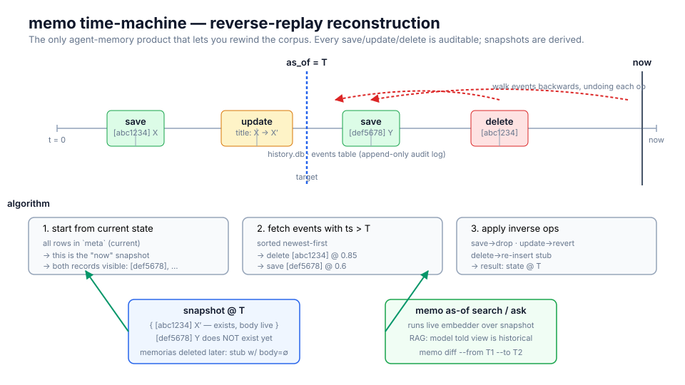
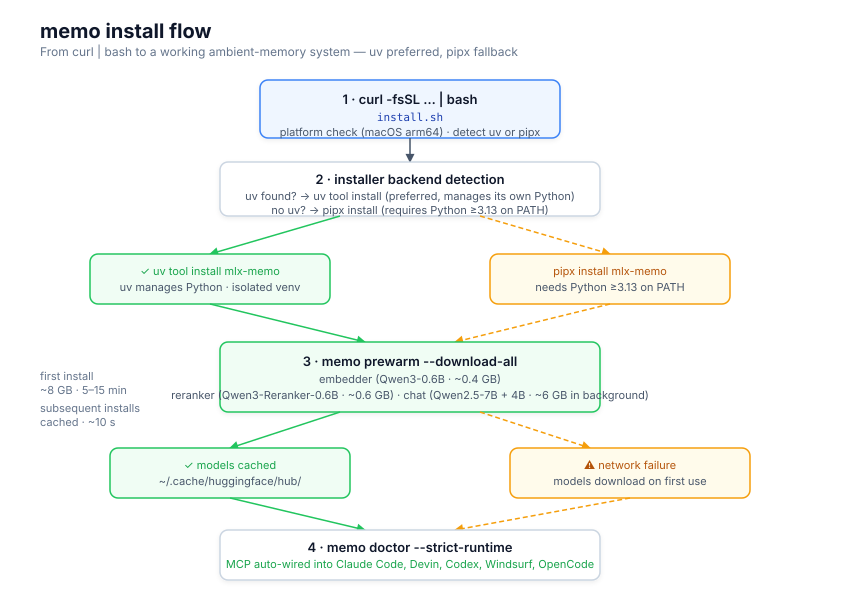
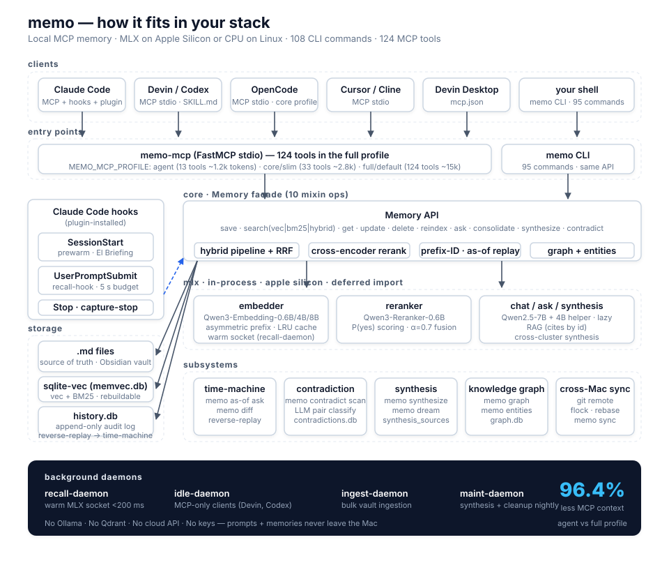
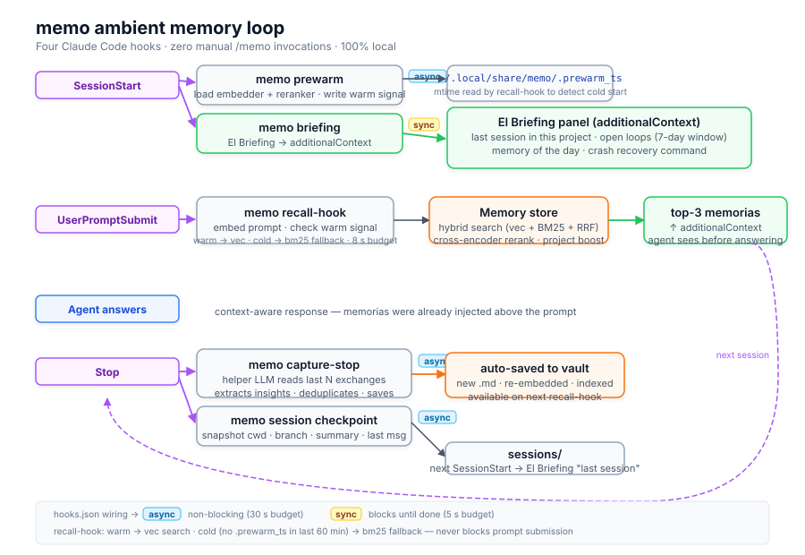

<div align="center">

# memo

**Persistent semantic memory for AI agents — 100% local, MLX-native, Apple Silicon.**

[](https://pypi.org/project/mlx-memo/)
[](https://pypi.org/project/mlx-memo/)
[](LICENSE)
[](https://modelcontextprotocol.io)
[](https://safeskill.dev/scan/jagoff-memo)

</div>

<!-- mcp-name: io.github.jagoff/memo -->

`memo` gives any MCP-aware agent (Claude Code, Claude Desktop, Cursor, Cline, Continue, Paperclip, …) a long-term memory that **runs entirely on your Mac**. It stores each memory as a plain Markdown file inside an Obsidian-friendly folder, indexes embeddings in a single sqlite file, and runs the LLM + embedder + reranker **in-process via [Apple MLX](https://github.com/ml-explore/mlx)** — no Ollama, no Qdrant, no cloud API, no keys.

> Your prompts and memorias never leave the machine.

---

## What it does

- **Saves what your agent decides, learns, prefers** as durable Markdown files (`type`, `tags`, `title`, body).
- **Recalls** the most relevant memorias when you ask — semantic (vec), keyword (BM25), or hybrid w/ cross-encoder rerank.
- **Injects context automatically**: with the optional Claude Code plugin, every prompt silently consults memory; the agent sees the top-3 memorias *before* answering.
- **El Briefing** — on session start, surfaces your open loops (recently updated memories), a daily memory rotation, and crash-recovery for the last session in the current project — all before the first prompt.
- **El Mapa** — generates an interactive 2D semantic canvas of your entire corpus via UMAP/PCA projection + Plotly, with timeline animation, search filter, and hover previews.
- **Speaks MCP** over stdio so any compliant client picks it up with one line of config.
- **Speaks shell** too: the same API ships as a `memo` CLI with ~30 commands.

## 🕰️ The unique feature: **time-machine**

memo is **the only agent-memory product that lets you rewind the corpus to any past date.** Every other store on the market (mem0, letta, cognee, supermemory, mem-vault, milasd/memo-mcp, doggybee, engram) serves *current* state only.

```bash
# What did I think about MLX vs Ollama three months ago?
memo as-of ask "MLX vs Ollama" --date 2026-02-01

# What changed in my decisions between releases?
memo diff --from 2026-03-01 --to 2026-04-30

# Search the corpus as it stood on a specific Monday
memo as-of search "auth middleware" --date 2026-03-15
```

Under the hood: `history.db` is an append-only audit log of every save/update/delete. A snapshot at any `T` is built by replaying events in reverse from "now". See [docs/time-machine.svg](docs/time-machine.svg) for the algorithm at a glance.



**Why this matters:**

- **Debug agent regressions.** "Claude gives a different answer now — which memoria I added last week broke it?" → `memo as-of ask "..." --date <before>` vs `--date <after>`.
- **Reproducible AI behavior.** Mount a snapshot as an alternate MCP and serve it to the agent so you can reproduce a past decision deterministically.
- **Personal audit.** "Did I already have this preference on 2026-03-01?" answered definitively from the audit log.
- **Compliance.** "What did the model know when it took action X?" — reconstruct the exact memory state at time T.

## Why memo

| Pain | What memo gives you |
|---|---|
| Cloud memory products see your private notes | **Zero network in the hot path.** Models run in-process. |
| Ollama / Qdrant / docker daemons just to remember things | **One Python install.** sqlite-vec is one file; MLX is in-process. |
| DB-only stores lock your knowledge inside an opaque blob | **Markdown is the source of truth.** Edit in Obsidian, vim, anything. |
| Cold-start latencies of 2-10s per recall | **Recall daemon** — persistent process keeps embedder in RAM; <200 ms per recall after session start. |
| Hand-crafted `/remember` invocations every turn | **Ambient recall + auto-capture**: top-3 hits injected on every prompt; insights extracted automatically after each exchange. |
| Every session starts blind — no recap of where you left off | **El Briefing**: open loops, memory of the day, crash recovery at `SessionStart`. |
| No way to visualise the corpus or find clusters | **El Mapa**: interactive 2D UMAP/PCA canvas of all embeddings, with timeline animation. |
| **No way to query past corpus state** | **Time-machine**: snapshot the corpus at any past date (see above). |
| Vendor lock | **MIT package, open stack** (sqlite-vec Apache 2.0, MLX MIT, Qwen Apache 2.0). |

## Install flow



The installer handles everything: Python check → pipx install → model download → doctor validation → MCP registration for Claude Code, Codex, and Windsurf. On first install the model download step takes 5-15 minutes depending on your connection (~7 GB). Subsequent installs skip the download (HuggingFace Hub cache hit).

## How it fits in your stack



Three layers, one direction of data flow:

1. **Clients** (Claude Code, Cursor, …) talk to memo over **MCP stdio** — or you talk to it directly via the **`memo` CLI**.
2. The **Memory API** runs save / search / rerank / ask against the **MLX models in-process**: embedder for semantic, optional reranker for precision, chat (Qwen2.5-7B) for `ask()`.
3. The **`.md` vault** is the storage of record; **`sqlite-vec`** is a rebuildable index. Delete the index any time — `memo reindex` rebuilds from the `.md` files.

With the Claude Code plugin installed, six hooks plug in automatically:

| Event | Command | Mode | Budget | Purpose |
|---|---|---|---|---|
| `SessionStart` (startup/clear) | `memo prewarm` | async | 30 s | Pre-loads MLX embedder + reranker; writes warm-signal file |
| `SessionStart` (startup/clear) | `memo recall-daemon start` | async | 5 s | Starts the recall daemon (keeps embedder in RAM; <200 ms recall) |
| `SessionStart` (startup/resume) | `memo briefing` | sync | 5 s | El Briefing panel: open loops, memory of the day, last session |
| `UserPromptSubmit` | `memo recall-hook` | sync | 8 s | Queries the recall daemon (fast path) or falls back to BM25 when cold |
| `Stop` | `memo capture-stop` | async | 30 s | Extracts insights from the finished exchange via helper LLM |
| `Stop` | `memo session checkpoint` | async | 5 s | Snapshots session state for crash recovery |



## Stack

| Component | Choice | Why |
|---|---|---|
| LLM (chat) | [`Qwen2.5-7B-Instruct-4bit`](https://huggingface.co/mlx-community/Qwen2.5-7B-Instruct-4bit) + [`3B helper`](https://huggingface.co/mlx-community/Qwen2.5-3B-Instruct-4bit) via [`mlx-lm`](https://github.com/ml-explore/mlx-lm) | Two-tier; 7B for `ask()` synthesis, 3B for cheap helpers. Both 4-bit fit comfortably. |
| Embedder | [`Qwen3-Embedding-0.6B-4bit-DWQ`](https://huggingface.co/mlx-community/Qwen3-Embedding-0.6B-4bit-DWQ) by default; [`Qwen3-Embedding-4B-4bit-DWQ`](https://huggingface.co/mlx-community/Qwen3-Embedding-4B-4bit-DWQ) in `quality` profile | 1024-dim default, 2560-dim quality. Choose via `MEMO_MODEL_PROFILE`. |
| Reranker | [`mku64/Qwen3-Reranker-0.6B-mlx-8Bit`](https://huggingface.co/mku64/Qwen3-Reranker-0.6B-mlx-8Bit) (enabled in `balanced` / `quality`) | Cross-encoder over top-30 from vec+BM25, then alpha-fusion. Bumps precision on diffuse queries. |
| Vector store | [`sqlite-vec`](https://github.com/asg017/sqlite-vec) | One file, no daemon, embedded. Reset = `rm memvec.db`. |
| Source of truth | Markdown files under `MEMO_DATA_DIR` with YAML frontmatter | Human-editable, syncs through iCloud/git/Syncthing/whatever. |
| MCP transport | [`fastmcp`](https://github.com/jlowin/fastmcp) | Stdio out of the box. |

## Requirements

- **macOS on Apple Silicon** (M1 / M2 / M3 / M4). MLX is the load-bearing piece.
- **Python ≥ 3.13**.
- **~8 GB** free disk for the default model set (embedder ~600 MB + reranker ~600 MB + chat 7B ~4.3 GB + helper 3B ~1.9 GB). The one-line installer downloads them automatically.
- *Optional:* an Obsidian vault. If you don't have one, memo defaults to `~/Documents/memo/` and creates the folder for you.

## Install

Recommended install: keep memo isolated as its own tool. Do **not** vendor it
inside another project's `.venv`; the MLX runtime, model cache, MCP server,
sqlite state, and CLI should move together as one subsystem.

```bash
# One-line installer (uses pipx under the hood, installs GitHub main,
# and configures Claude Code + Codex + Windsurf when available)
curl -fsSL https://raw.githubusercontent.com/jagoff/memo/master/install.sh | bash
# or install the latest published PyPI release explicitly
pipx install mlx-memo
# or
uv tool install mlx-memo
# or via the Homebrew tap
brew tap jagoff/memo && brew install mlx-memo
```

Any of those expose two binaries: `memo` (CLI) and `memo-mcp` (MCP server).
For MCP clients, prefer an isolated tool install (`pipx`, `uv tool`, or
Homebrew) instead of installing into another project's `.venv`; that keeps
memo's MLX dependencies, sqlite state, and `memo-mcp` runtime independent
from whichever repo happens to be active in your shell.

> The PyPI distribution is **`mlx-memo`** as of 0.5.0. Earlier
> versions shipped as `memo-mcp` and the binary names haven't
> changed — existing MCP configs keep working.
> The one-line installer intentionally installs GitHub `master` by default
> so it can deploy repo changes before the next PyPI release exists.

If you are developing this repo and want the real system install to use your
checkout:

```bash
pipx install --force /path/to/memo
memo doctor --strict-runtime
memo --version
```

Installer knobs:

```bash
# Install the latest published PyPI release instead of GitHub main.
curl -fsSL https://raw.githubusercontent.com/jagoff/memo/master/install.sh | MEMO_INSTALL_FROM_PYPI=1 bash

# Pin a published PyPI version.
curl -fsSL https://raw.githubusercontent.com/jagoff/memo/master/install.sh | MEMO_VERSION=0.6.0 bash

# Install from an explicit pipx spec (local checkout, git ref, wheel, etc.).
MEMO_INSTALL_SPEC=/Users/you/repos/memo ./install.sh

# Skip agent-client configuration during install.
curl -fsSL https://raw.githubusercontent.com/jagoff/memo/master/install.sh | MEMO_INSTALL_SKIP_AGENT_CONFIG=1 bash

# Force-skip the MLX model download (models will load lazily on first use).
curl -fsSL https://raw.githubusercontent.com/jagoff/memo/master/install.sh | MEMO_INSTALL_DOWNLOAD_MODELS=no bash

# Force-yes the MLX model download (skip the interactive confirmation).
curl -fsSL https://raw.githubusercontent.com/jagoff/memo/master/install.sh | MEMO_INSTALL_DOWNLOAD_MODELS=yes bash
```

**Model download** is part of memo's structure (embedder + reranker + chat models are required for retrieval and ambient recall). On an interactive terminal the installer asks for confirmation (default `Y`). On a piped install (`curl … | bash`, no TTY) the default is also yes. Override with `MEMO_INSTALL_DOWNLOAD_MODELS=yes|no|auto`. You can re-run the download manually any time:

```bash
# Download all default-profile models (~7 GB, shows progress, safe to re-run)
MEMO_NONINTERACTIVE=1 memo prewarm --download-all

# Or download individual models with the HF CLI
hf download mlx-community/Qwen3-Embedding-0.6B-4bit-DWQ
hf download mku64/Qwen3-Reranker-0.6B-mlx-8Bit
hf download mlx-community/Qwen2.5-3B-Instruct-4bit
hf download mlx-community/Qwen2.5-7B-Instruct-4bit

# Optional quality profile.
hf download mlx-community/Qwen3-Embedding-4B-4bit-DWQ
hf download mlx-community/Qwen3-4B-Instruct-2507-4bit-DWQ-2510
```

### Installing on another Mac

For a fresh Apple Silicon Mac, run the one-line installer first, then bring over the corpus:

```bash
curl -fsSL https://raw.githubusercontent.com/jagoff/memo/master/install.sh | bash
memo doctor --strict-runtime
memo install-slash --client claude-code --client codex --client windsurf
```

The installer already runs the `install-slash` command in best-effort mode. Re-run it manually after installing or updating Claude Code, Codex, or Windsurf so each client reloads the absolute `memo-mcp` path from the new machine.

To move existing data:

```bash
# On the old Mac: portable zip with .md memorias + memvec.db + history.db.
memo backup --out ~/Desktop/memo-transfer.zip

# On the new Mac, after installing memo:
memo restore ~/Desktop/memo-transfer.zip --reindex --yes
memo doctor --strict-runtime
```

If your memorias already live in an iCloud/Syncthing/Git-synced Obsidian folder, point the new Mac at that same folder instead of copying the zip:

```bash
memo init
memo reindex
```

`MEMO_DATA_DIR` contains the human-readable `.md` source of truth. `MEMO_STATE_DIR` defaults to `~/.local/share/memo` and contains rebuildable indexes plus sidecars such as `history.db`; keep `history.db` if you want time-machine snapshots to survive the move. See [docs/install-new-mac.md](docs/install-new-mac.md) for the full checklist.

### Verify no old install is being used

```bash
which -a memo
which -a memo-mcp
pipx list --short
python3 -m pip show memo mlx-memo memo-mcp
brew list --versions mlx-memo memo
memo doctor --strict-runtime
```

Healthy isolated install:

- `which -a memo` prints a single `~/.local/bin/memo` (or your `uv tool` /
  Homebrew equivalent).
- `memo` and `memo-mcp` resolve from the same isolated environment.
- `pipx list --short` shows `mlx-memo <version>` when installed via `pipx`.
- `python3 -m pip show ...` does not find a competing global install.
- `memo doctor --strict-runtime` passes.

### Dev install (contributors)

```bash
git clone https://github.com/jagoff/memo
cd memo
uv pip install -e '.[dev]'
```

## Quick start

```bash
# Self-check (validates models, vault path, sqlite-vec)
memo doctor

# Save a memory
memo save 'Bench MLX vs Ollama: ~30% faster prefill on M3 Max' \
  --title 'MLX bench result' -t bench -t mlx

# Search by meaning (not just keywords)
memo search 'cuál fue el resultado del bench MLX'

# Recent
memo list --limit 5

# RAG — ask a question, memo cites memorias by id
memo ask 'qué cambios hice en el embedder este mes?'

# Chat-shaped RAG envelope for Synapse and other front doors
memo chat-ask 'qué cambios hice en el embedder este mes?' --json
```

## MCP setup

After installing `mlx-memo`, register the MCP with your client. The `memo`
CLI prints commands pinned to the resolved `memo-mcp` executable so clients
do not accidentally start a copy from a project `.venv`.

If you use memo from agent clients, the one-shot installer configures the
client-visible command/skill where the client supports it and the MCP server
for supported surfaces: Claude Code, Codex, Windsurf, and Devin.

```bash
memo install-slash
```

`install-slash` forwards current `MEMO_*` model/storage env vars into each MCP
client config. This matters when you run the 2560-dim quality embedder: GUI
clients often do not inherit your shell env, and a 1024/2560 mismatch will
break semantic search until the MCP config is updated or `memvec.db` is rebuilt.

Released wheels include the Claude/Codex/Devin agent assets, so a normal
`pipx` / `uv tool` / Homebrew install is enough. When developing from a local
checkout, pass `--repo /path/to/memo` to test uncommitted plugin changes.

### Claude Code

```bash
memo mcp-command --client claude-code
# then run the printed command, e.g.
claude mcp add-json -s user memo '{"type":"stdio","command":"/Users/you/.local/pipx/venvs/mlx-memo/bin/memo-mcp","args":[],"env":{"MEMO_NONINTERACTIVE":"1"}}'
```

Or hand-edit `~/.claude.json`:

```jsonc
{
  "mcpServers": {
    "memo": {
      "type": "stdio",
      "command": "/path/to/memo-mcp",
      "args": [],
      "env": {
        "MEMO_NONINTERACTIVE": "1"
      }
    }
  }
}
```

Restart Claude Code. Tools surface as `mcp__memo__memory_*` inside the agent.
If Claude starts the wrong server, run `memo doctor --strict-runtime`; it
will warn when `memo`/`memo-mcp` resolve from a project-local venv or from
different environments.

### Codex CLI

Codex supports local stdio MCP servers through `codex mcp add`:

```bash
memo mcp-command --client codex
# then run the printed command, e.g.
codex mcp add memo --env MEMO_NONINTERACTIVE=1 -- /Users/you/.local/pipx/venvs/mlx-memo/bin/memo-mcp
codex mcp list
```

Tools surface as `mcp__memo__memory_*` inside Codex sessions.

Install the Codex assets so the exact `memo` skill is available alongside the
MCP server:

```bash
memo install-slash --client codex
```

Current Codex CLI builds, including 0.130.0, list only built-in slash commands
in the TUI slash dispatcher. The installer still writes the exact `memo` skill
to `$CODEX_HOME/skills/memo/SKILL.md`; Codex can load it as a model-visible
skill and route to the `memo` MCP server, but `/memo` will not appear in that
TUI menu until Codex exposes custom skills there.

### Devin for Terminal

Devin supports stdio MCP servers through `devin mcp add`. Use `-s user` for
a global install across projects:

```bash
memo mcp-command --client devin
# then run the printed command, e.g.
devin mcp add -s user -e MEMO_NONINTERACTIVE=1 memo -- /Users/you/.local/pipx/venvs/mlx-memo/bin/memo-mcp
devin mcp list
```

### Claude Desktop

Edit `~/Library/Application Support/Claude/claude_desktop_config.json`:

```jsonc
{
  "mcpServers": {
    "memo": {
      "command": "/path/to/memo-mcp",
      "env": {
        "MEMO_NONINTERACTIVE": "1"
      }
    }
  }
}
```

### Windsurf / Cascade

Windsurf stores Cascade MCP servers in `~/.codeium/windsurf/mcp_config.json`
and asks you to refresh MCP servers after editing the config. memo can write
that file directly:

```bash
memo install-slash --client windsurf
```

Or print the JSON block for manual editing:

```bash
memo mcp-command --client windsurf
```

This preserves any existing `mcpServers` and only replaces the `memo` entry.
If you need a non-standard config path, set `WINDSURF_MCP_CONFIG` before
running the installer.

### Cursor / Cline / Continue

Each client has its own MCP config UI but the contract is the same: register
a stdio server pointing at the `memo-mcp` binary. To print a portable
`mcpServers` block:

```bash
memo mcp-command --client json
```

### Paperclip

A first-party plugin under [`integrations/paperclip-plugin-memo/`](./integrations/paperclip-plugin-memo) exposes five tools (`memo_search`, `memo_save`, `memo_list`, `memo_get`, `memo_ask`) to any agent running in a Paperclip company.

## Tools exposed over MCP

| Tool | What it does |
|---|---|
| `memory_save(content, title?, type?, tags?)` | Persist a new memory; returns the full record. |
| `memory_search(query, limit?, type?, body_chars=280, mode="hybrid")` | Top-k. `hybrid` (default) fuses vec + bm25 via RRF, then optionally re-ranks. `vec` is semantic only; `bm25` is keyword (FTS5 unicode61, diacritic-stripping for Spanish). |
| `memory_list(limit?, type?)` | Recent by `updated` desc. |
| `memory_get(id)` | Full record. Accepts a unique prefix ≥4 chars (git-style); returns `{"error": "ambiguous", "matches": [...]}` on collision. |
| `memory_update(id, title?, type?, tags?, content?)` | Patches fields; re-embeds only if body changed. |
| `memory_reindex()` | Re-scan vault, re-embed entries whose `body_hash` diverged. |
| `memory_delete(id)` | Removes from vec + disk. |
| `memory_ask(question)` | RAG synthesis; cites memorias by id. |
| `memory_chat_ask(question, history?, context?)` | Chat-shaped RAG envelope (`memo.chat_ask.v2`) with answer, citations, retrieval trace, and synthesis status. |
| `memory_stats()` | Counts, paths, active models. |
| `memory_history(limit?, record_id?)` | Recent save/update/delete events, optionally filtered to one record. |
| `memory_record_diff(id, limit?)` | Chronological audit trail for one record with field-level diffs (same as `memo historia <id>`). |
| `memory_consolidate()`, `memory_extract_entities()`, `memory_entities()` | Corpus maintenance — see CHANGELOG. |

## Ambient memory (v0.3.0+) — recall without `/memo`

Install the bundled [Claude Code plugin](#slash-command--memo) and memo silently consults your past on every prompt and injects the most relevant memorias as `additionalContext` — **the agent sees them before answering**, no manual invocation.

### How it works

- **`SessionStart` (startup/clear)** → `memo prewarm` (async, 30 s) — loads the MLX embedder + reranker into the OS disk cache and writes a warm-signal file (`~/.local/share/memo/.prewarm_ts`).
- **`SessionStart` (startup/clear)** → `memo recall-daemon start` (async, 5 s) — starts the **recall daemon**, a persistent process that keeps the embedder loaded in RAM. Once running, every `recall-hook` call in the session queries it via a Unix socket and gets a result in <200 ms instead of 1–2 s. Logs to `~/Library/Logs/memo/recall-daemon.log`.
- **`SessionStart` (startup/resume)** → `memo briefing` (5 s) — emits El Briefing as `additionalContext` at the top of every session.
- **`UserPromptSubmit`** → `memo recall-hook` (8 s) — queries the recall daemon (fast path, <200 ms) or falls back to BM25 keyword search if the daemon isn't running yet (cold start). Returns top-3 memorias above cosine 0.6 as `additionalContext` before the agent answers.
- **`Stop`** → `memo capture-stop` (async, 30 s) — helper LLM reads the just-finished exchange, extracts actionable insights, runs a quality gate (`MEMO_CAPTURE_MIN_WORDS`), deduplicates against the corpus, and saves survivors automatically.
- **`Stop`** → `memo session checkpoint` (async, 5 s) — snapshots `cwd`, branch, summary, and last message to `~/.local/share/memo/sessions/` so crashed sessions can be resumed.

All hooks run 100 % local. Your prompts never leave the machine.

### Recall daemon

The recall daemon is the hot-path optimization that makes ambient recall feel instant. Without it, each `UserPromptSubmit` spawns a fresh Python process that re-imports MLX from disk (~1–2 s even when cached). With it, a single long-lived process keeps the embedder in RAM and answers socket requests in **<200 ms**.

```
SessionStart
  └─ memo recall-daemon start (async)
       └─ loads Memory + embedder
       └─ listens on ~/.local/share/memo/recall.sock

UserPromptSubmit
  └─ memo recall-hook
       ├─ daemon running? → socket request → <200 ms → additionalContext
       └─ daemon not ready? → BM25 fallback → ~100 ms → additionalContext
```

The daemon is started automatically. You can also manage it manually:

```bash
memo recall-daemon start    # start in background
memo recall-daemon stop     # send SIGTERM + cleanup
memo recall-daemon status   # pid, socket path, warm/cold state
```

Logs: `~/Library/Logs/memo/recall-daemon.log`

The daemon restarts automatically on the next session start if it has exited (macOS may kill background processes under memory pressure).

### Recall tuning

| Env var | Default | Purpose |
|---|---|---|
| `MEMO_RECALL_DISABLE` | unset | Set to `1` to skip recall entirely |
| `MEMO_RECALL_TOP_K` | `3` | Max memorias to inject |
| `MEMO_RECALL_MIN_SIM` | `0.6` | Cosine similarity floor |
| `MEMO_RECALL_MIN_PROMPT_CHARS` | `12` | Skip very short prompts |
| `MEMO_RECALL_BODY_CHARS` | `240` | Snippet length per memoria |
| `MEMO_RECALL_SKIP_SLASH` | `1` | Skip recall on `/` prompts |
| `MEMO_RECALL_TOKEN_BUDGET` | `0` | When > 0, pack memorias greedily until ~N tokens; truncate tail to fit |
| `MEMO_RECALL_PROJECT_BOOST` | `0.15` | Additive score boost for memorias whose tags match the current project tag |
| `MEMO_RECALL_MIN_BODY_CHARS` | `40` | Filter out stub memorias (empty or near-empty bodies) |
| `MEMO_RECALL_FORCE_MODE` | unset | Set to `1` to disable the warm-signal cold-start check (always use `MEMO_RECALL_MODE`) |
| `MEMO_RECALL_DEBUG` | unset | Print failure reasons to stderr |

### Capture tuning

| Env var | Default | Purpose |
|---|---|---|
| `MEMO_CAPTURE_CONTEXT_TURNS` | `3` | Number of recent exchanges fed to the helper LLM (richer context catches multi-turn decisions) |
| `MEMO_CAPTURE_COOLDOWN_MIN` | `0` | Min minutes between captures in the same session (prevents corpus flooding during long refactors) |
| `MEMO_CAPTURE_MIN_WORDS` | `15` | Minimum word count for an extracted insight. Generic session summaries and very short extracts are discarded. Set to `0` to disable. |
| `MEMO_CAPTURE_DEBUG` | unset | Print extraction results to stderr |

The capture pipeline applies a **quality gate** before saving. Extracted insights are discarded if they are too short (< `MEMO_CAPTURE_MIN_WORDS` words) or start with session-narrative openers like `"the user "`, `"we discussed "`, `"i helped "`, etc. This prevents the corpus from accumulating low-value summaries that degrade recall precision over time. Only specific, durable knowledge passes through.

### Empirical tuning of `MIN_SIM=0.6`

On a 223-doc corpus:
- `qué decidí sobre MLX vs Ollama` → 3 hits at 0.71–0.74 (relevant ✓)
- `how to bake apple pie` (no food memorias) → 0 hits at 0.6 ✓ (3 noise hits at 0.51–0.56 cut by the floor)

Tune lower (0.5) on sparse corpora, higher (0.7) for high-precision only.

## El Briefing — session start panel

`memo briefing` is the `SessionStart` hook entrypoint. Every time you open a new Claude Code session it emits an `additionalContext` panel with three blocks:

1. **Last session in this project** — summary of the most recent session in the current `cwd`, with a one-line `claude --resume <session_id>` for instant crash recovery.
2. **Open loops** — the N memories most recently updated (default: 7-day window), numbered for interactive selection. Say *"dame el loop 2"* and the agent retrieves it.
3. **Memory of the day** — one memory picked deterministically by a SHA-256 hash of today's date, biased toward the least-recently-touched entries so the corpus rotates over time.

```markdown
## El Briefing

**Última sesión en este proyecto** (hace 12m): revisa el proyecto…
`claude --resume be72126f-3bcb-4faa-9a0f-dd97b8caa296`

### Loops abiertos (últimos 7 días)

1. `91fc486c` **note** · memo diff como superficie de cambio real — hoy [memory, versioning]
2. `5da4cdc1` **note** · Recall hook más inteligente — hoy [memory, recall]
…

### Memoria del día
`064031dd` **fact** · sqlite-vec L2 normalisation invariant — hace 3 días
> El embedder debe normalizar a L2 antes de guardar…

_Para continuar: `dame el loop N` · `/memo get <id>` · `/memo ask <pregunta>`_
```

| Env var | Default | Purpose |
|---|---|---|
| `MEMO_BRIEFING_DISABLE` | unset | Set to `1` to skip the panel |
| `MEMO_BRIEFING_LOOPS_N` | `5` | Number of open loops to show |
| `MEMO_BRIEFING_LOOPS_DAYS` | `7` | Recency window for open loops |
| `MEMO_BRIEFING_DEBUG` | unset | Print failures to stderr |

Run `memo briefing` directly from the shell to preview the output.

## El Mapa — 2D semantic canvas

`memo mapa` reads all embeddings stored in `memvec.db`, projects them to 2D via **UMAP** (if `umap-learn` is installed) or **PCA** (numpy fallback), and renders a self-contained interactive HTML file.

```bash
# Generate and open in default browser
memo mapa

# Specify output path, skip auto-open
memo mapa --output ~/Desktop/mapa.html --no-open

# Limit to the 200 most recent entries
memo mapa --limit 200

# Skip timeline animation (faster for large corpora)
memo mapa --no-animate
```

Features of the generated HTML:

- **Points coloured by type** (decision, fact, bug, preference, feedback, note, manual)
- **Hover** → title, type, tags, creation date
- **Click** → sidebar opens with full metadata and a one-click copy button for `/memo get <id>`
- **Search filter** — type to highlight matching memories, dim others
- **Timeline slider** — animate the corpus growth over time from oldest to newest entry
- **Dark theme**, self-contained (Plotly via CDN, no other assets)

For better cluster topology, install `umap-learn`:

```bash
# In memo's isolated environment
pipx runpip mlx-memo install umap-learn
# or if developing from checkout:
.venv/bin/pip install umap-learn
```

Without it, PCA is used — fast and correct in terms of variance ordering, but it collapses nonlinear cluster structure. UMAP reveals the semantic groupings more faithfully for corpora of 50+ entries.

## Slash command — `/memo`

`/memo` is shipped only for CLIs that can actually expose an exact custom
`/memo`. The backend is always the same isolated `memo-mcp` server.

### Claude Code

The Claude Code plugin registers the `/memo` skill, MCP server, and ambient
hooks together:

```bash
memo install-slash --client claude-code
# or manually:
claude plugin marketplace add jagoff/memo
claude plugin install memo@memo -s user
claude plugin list
claude mcp list
```

If you are developing from a local checkout, register that checkout as the
marketplace instead:

```bash
claude plugin marketplace add /path/to/memo
claude plugin install memo@memo -s user
```

Restart Claude Code, or open a new session, after installing from the CLI so
the slash-command registry reloads. Existing interactive sessions may not pick
up newly installed plugins until restart.

For skill-only development without hooks or MCP config:

```bash
mkdir -p ~/.claude/skills/memo
ln -sf "$(pwd)/skills/memo/SKILL.md" ~/.claude/skills/memo/SKILL.md
```

### Codex

`memo install-slash --client codex` installs two things:

- a user skill at `$CODEX_HOME/skills/memo/SKILL.md` (or
  `~/.codex/skills/memo/SKILL.md`) so Codex can load the memo router skill;
- the Codex plugin under `plugins/memo/`, which registers the `memo` MCP server
  and carries the marketplace metadata.

```bash
memo install-slash --client codex
# manual plugin-only path:
codex plugin marketplace add /path/to/memo
# then install/enable memo@memo from Codex's plugin UI
```

Open a new Codex session after installing so plugin skills and MCP tools
reload. Current Codex CLI builds, including 0.130.0, list only built-in slash
commands in the TUI slash dispatcher; the installed Codex skill is still named
`memo`, but `/memo` will not appear in that TUI menu until Codex exposes custom
skills there.

### Devin

Devin reads skills from `~/.config/devin/skills/<name>/SKILL.md`. Install the
same `/memo` router skill there:

```bash
memo install-slash --client devin
# or manually:
mkdir -p ~/.config/devin/skills/memo
cp /path/to/memo/skills/memo/SKILL.md ~/.config/devin/skills/memo/SKILL.md
memo mcp-command --client devin
devin skills list
```

Open a new Devin session after installing the skill.

The skill routes user input to the right MCP tool:

| Input | Action |
|---|---|
| `/memo <query>` | semantic search (k=5, snippet body) |
| `/memo` | smart capture — destila el insight del turno y guarda |
| `/memo list [n]` | recent memories |
| `/memo save <text>` | save with auto-derived type/tags |
| `/memo get <id\|prefix>` | full record (prefix ≥4 chars) |
| `/memo update <id\|prefix> [flags] [body]` | patch metadata or body |
| `/memo delete <id\|prefix>` | delete (asks confirmation) |
| `/memo ask <question>` | RAG synthesis with citations |
| `/memo stats` | totals + paths + models |
| `/memo reindex` | absorb edits made directly in Obsidian |
| `/memo history [op] [id]` | audit log of save/update/delete |
| `/memo consolidate [threshold]` | cluster near-duplicates + merge proposals |
| `/memo mapa [--output FILE]` | generate 2D semantic canvas HTML |
| `/memo doctor [--gc] [--fix]` | self-check + orphan detect |

## CLI reference

```bash
# ── Core CRUD ──────────────────────────────────────────────────────────────
memo save 'body markdown' --title 'X' -t mlx -t local
memo search 'query' --limit 5
memo list --limit 20 --type decision
memo get <id>
memo update <id> --title 'X2' -t mlx -t local --type decision
memo update <id> --content -      # read replacement body from stdin
memo delete <id> --yes
memo reindex                      # absorb edits made directly in Obsidian
memo stats
memo ask 'what changed in the embedder this month?'

# ── History & audit ────────────────────────────────────────────────────────
memo historia <id>                # chronological audit trail for one record with field diffs
memo history                      # recent save/update/delete events across all records

# ── Ambient memory commands (also run by hooks) ────────────────────────────
memo briefing                     # preview the SessionStart panel in the terminal
memo recall-hook                  # UserPromptSubmit hook (reads JSON from stdin)
memo prewarm                      # pre-load MLX models (SessionStart hook)
memo capture-stop                 # extract insights from last exchange (Stop hook)
memo session checkpoint           # snapshot current session state (Stop hook)
memo session recent --limit 5     # list recent sessions

# ── El Mapa — 2D semantic canvas ───────────────────────────────────────────
memo mapa                         # generate + open in browser (UMAP or PCA → Plotly HTML)
memo mapa --output ~/Desktop/mapa.html --no-open
memo mapa --limit 200 --no-animate

# ── Setup & maintenance ────────────────────────────────────────────────────
memo doctor                       # self-check
memo doctor --gc                  # report orphans (store ↔ disk)
memo doctor --gc --fix            # drop orphan store rows (.md never auto-deleted)
memo install-slash                # configure Claude Code, Codex, Windsurf, Devin
memo mcp-command --client windsurf # print Windsurf mcp_config.json block
memo init                         # re-run first-run picker
memo migrate-vault <new-path>     # move memorias to a different folder
memo backup --out memo.zip        # backup .md files + index

# ── Time-machine ───────────────────────────────────────────────────────────
memo as-of search 'query' --date 2026-03-01    # search a past snapshot
memo as-of ask 'question' --date 2026-03-01    # RAG on a past snapshot
memo as-of list --date 2026-03-01              # memorias that existed then
memo diff --from 2026-03-01 --to 2026-04-30    # diff between two snapshots

# ── Knowledge graph ─────────────────────────────────────────────────────────
memo entities                     # top entities across the corpus
memo entity <name>                # memorias that mention a specific entity
memo extract-entities --all       # populate the entity graph (Qwen 3B, batch)
memo consolidate                  # cluster near-duplicates + merge proposals

# ── Backfill & watching ────────────────────────────────────────────────────
memo mine-history --since 30      # backfill memorias from past Claude Code chats
memo watch                        # foreground file-watcher: auto-reindex on .md edit
memo install-watcher              # background watcher via launchd plist
memo uninstall-watcher            # remove the launchd watcher job

# ── Recall daemon ───────────────────────────────────────────────────────────
memo recall-daemon start          # start the persistent recall daemon (started automatically by the hook)
memo recall-daemon stop           # stop the daemon
memo recall-daemon status         # show pid + socket + warm/cold state

# ── Observability ───────────────────────────────────────────────────────────
memo hook-log                     # last 20 recall-hook entries: mode, via, hits, latency
memo hook-log --limit 50
memo hook-log --follow            # stream new entries as they arrive (Ctrl+C to stop)

# ── Updates ─────────────────────────────────────────────────────────────────
memo self-update                  # upgrade via pipx/uv + re-warm models
memo self-update --check          # check PyPI for a newer version without installing

# ── Live dashboard ─────────────────────────────────────────────────────────
memo tui                          # live terminal dashboard (Ctrl+C exits)
```

### Live dashboard — `memo tui`


Six panels, all-colored, refresh every second by default:

- **corpus** — total memorias, distinct project tags, top 3 types
- **runtime** — MLX warm/cold flags (`emb` / `rrk` / `chat`), vault size, watcher state
- **recent saves** — last 5 entries from `history.db`
- **recent recalls** — last 4 entries from the recall log, with mode (`vec`/`bm25`) and path (`daemon`/`subprocess`) per row. Panel title shows `daemon: running | warm` / `daemon: off | cold` live status.
- **top tags** — most-frequent corpus tags (`project:*` highlighted)
- **activity** — 14-day saves/recalls sparklines (`▁▂▃▄▅▆▇█`)

Reads read-only from `history.db` (saves), the JSONL recall log written by `memo recall-hook` (auto-rotated at ~200 KB), the daemon PID file, and the warm-signal file. No new dependencies — Rich was already pulled in.

Quit with `q`, `ESC`, or `Ctrl+C`.

### Hook observability — `memo hook-log`

Every `recall-hook` invocation is appended to a JSONL ring buffer at `~/.local/share/memo/recall.log` (auto-rotated at ~200 KB). `memo hook-log` reads it and prints a human-readable summary:

```
2026-05-16 14:32:01  vec     daemon   3 hits   187 ms   "como podemos mejorar todo?"
2026-05-16 14:31:44  bm25    subproc  1 hit    94 ms    "resolve todo"
2026-05-16 14:28:12  vec     daemon   0 hits   203 ms   "que hace el prewarm"
```

Each row shows: timestamp · search mode (`vec` / `bm25`) · path (`daemon` / `subprocess`) · hit count · latency · prompt snippet.

```bash
memo hook-log              # last 20 entries
memo hook-log --limit 100
memo hook-log --follow     # stream live (Ctrl+C to stop)
```

The TUI (`memo tui`) also shows the last 4 recalls in its recall panel, including the daemon/subprocess indicator and a `daemon: running | warm` status line.

### Updating — `memo self-update`

```bash
memo self-update           # detect pipx/uv, upgrade, re-warm models
memo self-update --check   # compare installed vs latest PyPI, no install
```

`self-update` detects the active install method automatically (checks `pipx list` then `uv tool list`) and runs the appropriate upgrade command. After a successful upgrade it runs `memo prewarm --download-all` to ensure any new model versions are cached before the next session. If neither pipx nor uv is detected (e.g. custom install path), it prints the manual commands to run.

### Backfill from past Claude Code conversations

`memo mine-history` walks `~/.claude/projects/<hash>/*.jsonl`, runs the
same prefilter + helper-LLM extract + embedding-dedup pipeline as the
live capture hook, and saves what's new. Resumable per file.

```bash
memo mine-history --since 30 --limit 20     # last 30 days, 20 newest sessions
memo mine-history --dry-run --debug         # cost estimation, no writes
```

### Auto-reindex on edit

Editing a memoria directly in Obsidian normally requires a manual
`memo reindex` to refresh embeddings. `memo watch` (foreground) or
`memo install-watcher` (background launchd job) debounces FS events
and runs `Memory.reindex()` automatically. Logs land in
`~/Library/Logs/memo/`.

### Project-scoped recall

`memo save` auto-attaches a `project:<repo>` tag derived from the git
toplevel of your cwd (or `MEMO_PROJECT_TAG`). The recall hook reads
`cwd` from the Claude Code hook payload and boosts memorias whose tags
match the current project by `MEMO_RECALL_PROJECT_BOOST` (default
`0.15`). Opt out per-call: `memo save --no-project-tag`. Disable
globally: `MEMO_AUTO_PROJECT_TAG=0`.

## First-run setup

The first time you run any `memo` command in an interactive shell, an arrow-key picker asks where memorias should live:

```
? Where should memo store your memorias?
❯ Standard macOS path: /Users/you/Documents/memo  (recommended)
  Obsidian vault: Notes  (/Users/you/Library/Mobile Documents/iCloud~md~obsidian/Documents/Notes)
  Obsidian vault: work-notes  (...)
  Custom path…
```

The choice is persisted to `~/.config/memo/config.toml`:

```toml
[storage]
data_dir = "/Users/you/Documents/memo"
# Optional — set when you pick an Obsidian vault. Used by `memo ingest`
# to bulk-index that vault's notes alongside your memorias.
vault_path = "/Users/you/Library/.../Notes"
```

Re-run the picker any time with `memo init`. To move memorias to a different location later:

```bash
memo migrate-vault ~/Documents/memo  # copies .md files, updates config, reindexes
```

Hooks (recall, prewarm, capture, session) get `MEMO_NONINTERACTIVE=1` prefixed in [`hooks/hooks.json`](./hooks/hooks.json) so they never trigger the picker.

## Configuration

All env vars are optional. Defaults aim at a fresh Apple Silicon Mac.

**Storage & paths**

| Env var | Default | What |
|---|---|---|
| `MEMO_DATA_DIR` | `~/Documents/memo` | Where memoria `.md` files live |
| `MEMO_VAULT_PATH` | `(unset)` | Optional Obsidian vault for `memo ingest` |
| `MEMO_STATE_DIR` | `~/.local/share/memo` | sqlite-vec DB + state |
| `MEMO_CONFIG_FILE` | `~/.config/memo/config.toml` | Override config-file path |
| `MEMO_NONINTERACTIVE` | unset | Set to `1` in hooks to skip the first-run picker |

**Models**

| Env var | Default | What |
|---|---|---|
| `MEMO_MODEL_PROFILE` | `balanced` | Model bundle: `light`, `balanced`, or `quality` |
| `MEMO_LLM_MODEL` | `mlx-community/Qwen2.5-7B-Instruct-4bit` | Chat tier |
| `MEMO_HELPER_MODEL` | `mlx-community/Qwen2.5-3B-Instruct-4bit` | Helper tier |
| `MEMO_EMBEDDER_MODEL` | `mlx-community/Qwen3-Embedding-0.6B-4bit-DWQ` | Embedder |
| `MEMO_EMBEDDER_DIMS` | `1024` | Embedding dim — must match the embedder |
| `MEMO_RERANKER_ENABLED` | `1` in `balanced` / `quality` | Enable cross-encoder rerank for hybrid search |
| `MEMO_RERANKER_MODEL` | `mku64/Qwen3-Reranker-0.6B-mlx-8Bit` | MLX reranker model |
| `MEMO_RERANKER_REVISION` | unset | Optional HF commit/revision pin for user-hosted reranker repos |
| `MEMO_RERANK_INPUT_K` | `30` | Hybrid candidates sent to the reranker |
| `MEMO_RERANK_FUSION_ALPHA` | `0.7` | Weight of reranker score vs RRF position bonus |

**Search**

| Env var | Default | What |
|---|---|---|
| `MEMO_MAX_CONTENT_CHARS` | `64000` | Truncate body before embed |
| `MEMO_SEARCH_DEFAULT_LIMIT` | `10` | Default `--limit` for search |
| `MEMO_SEARCH_DECAY_HALFLIFE` | `0` | When > 0, blend recency into scores. Half-life in days (`exp(-days/N)`) |
| `MEMO_SEARCH_DECAY_ALPHA` | `0.15` | Weight of decay signal vs raw similarity (0 = off, 1 = decay only) |

**Tagging**

| Env var | Default | What |
|---|---|---|
| `MEMO_AUTO_PROJECT_TAG` | `1` | Auto-add `project:<repo>` tag from git toplevel on save. Set `0` to disable. |
| `MEMO_PROJECT_TAG` | unset | Explicit project tag (overrides git-toplevel detection) |

**Recall hook** — see also [Recall tuning](#recall-tuning)

| Env var | Default | What |
|---|---|---|
| `MEMO_RECALL_DISABLE` | unset | Set to `1` to skip recall entirely |
| `MEMO_RECALL_TOP_K` | `3` | Max memorias to inject |
| `MEMO_RECALL_MIN_SIM` | `0.6` | Cosine similarity floor |
| `MEMO_RECALL_MIN_BODY_CHARS` | `40` | Filter stub memorias (short/empty bodies) |
| `MEMO_RECALL_MIN_PROMPT_CHARS` | `12` | Skip very short prompts |
| `MEMO_RECALL_BODY_CHARS` | `240` | Snippet length per memoria |
| `MEMO_RECALL_TOKEN_BUDGET` | `0` | When > 0, pack until ~N tokens; truncate tail |
| `MEMO_RECALL_PROJECT_BOOST` | `0.15` | Score boost for memorias matching current project |
| `MEMO_RECALL_SKIP_SLASH` | `1` | Skip recall on `/` prompts |
| `MEMO_RECALL_DEBUG` | unset | Print failure reasons to stderr |

**Auto-capture** — see also [Capture tuning](#capture-tuning)

| Env var | Default | What |
|---|---|---|
| `MEMO_CAPTURE_CONTEXT_TURNS` | `3` | Recent exchanges sent to helper LLM for insight extraction |
| `MEMO_CAPTURE_COOLDOWN_MIN` | `0` | Min minutes between captures (0 = no cooldown) |
| `MEMO_CAPTURE_MIN_WORDS` | `15` | Minimum word count for an extracted insight (0 = disabled) |
| `MEMO_CAPTURE_DEBUG` | unset | Print extraction details to stderr |

**El Briefing** — see also [El Briefing](#el-briefing--session-start-panel)

| Env var | Default | What |
|---|---|---|
| `MEMO_BRIEFING_DISABLE` | unset | Set to `1` to skip the briefing panel |
| `MEMO_BRIEFING_LOOPS_N` | `5` | Open loops to show |
| `MEMO_BRIEFING_LOOPS_DAYS` | `7` | Recency window for open loops |
| `MEMO_BRIEFING_DEBUG` | unset | Print failures to stderr |

Resolution precedence (highest first): explicit kwargs → `MEMO_*` env vars → `~/.config/memo/config.toml` → legacy `MEMO_VAULT_PATH` + `MEMO_MEMORY_SUBDIR` (back-compat) → hardcoded defaults.

Model profiles:

- `light`: 0.6B embedder, Qwen2.5 chat/helper, no reranker. Best for low-latency hooks.
- `balanced`: 0.6B embedder + 0.6B reranker + Qwen2.5 chat/helper. Default for most users.
- `quality`: 4B embedder (2560 dims) + 0.6B reranker + Qwen3 4B chat. Requires `rm ~/.local/share/memo/memvec.db && memo reindex` when switching from 1024-dim profiles.

If models are still downloading, you can save without MLX and keep keyword search available:

```bash
memo save "text to remember" --title "Short title" --defer-embed
memo search "text" --mode bm25
# later, once the embedder is cached:
memo reindex
```

## Upgrading the embedder

The default 0.6B is fast (~50 ms/embed) and small (~600 MB) but recall on diffuse queries (where the doc title doesn't lexically overlap with the query) can be noisy. For the 200–2000 memorias range, swap to the 4B variant when the noise starts to bite.

| Model | Dims | Disk | Recall | Per-embed |
|---|---|---|---|---|
| [`Qwen3-Embedding-0.6B-4bit-DWQ`](https://huggingface.co/mlx-community/Qwen3-Embedding-0.6B-4bit-DWQ) *(default)* | 1024 | ~600 MB | OK | ~50 ms |
| [`Qwen3-Embedding-4B-4bit-DWQ`](https://huggingface.co/mlx-community/Qwen3-Embedding-4B-4bit-DWQ) | 2560 | ~3 GB | better | ~200 ms |
| [`Qwen3-Embedding-8B-4bit-DWQ`](https://huggingface.co/mlx-community/Qwen3-Embedding-8B-4bit-DWQ) | 4096 | ~5 GB | best | ~400 ms |

To upgrade (example: 0.6B → 4B):

```bash
# 1) Pre-download.
hf download mlx-community/Qwen3-Embedding-4B-4bit-DWQ
hf download mlx-community/Qwen3-4B-Instruct-2507-4bit-DWQ-2510

# 2) Point memo at the quality bundle.
export MEMO_MODEL_PROFILE=quality

# 3) Backup before destructive re-embed.
memo backup --out memo-pre-4b.zip

# 4) Wipe the index and rebuild.
rm ~/.local/share/memo/memvec.db
memo reindex
memo doctor --strict-runtime
```

The dim mismatch is a hard error: `MEMO_EMBEDDER_DIMS` must match the new model's hidden size. `memo doctor` validates the dim at load.

## Design notes

- **One sqlite file, no Qdrant.** `sqlite-vec` outperforms a small Qdrant snapshot for the size of corpus memo targets (a few thousand entries, single-writer). Single file makes reset trivial: `rm memvec.db`.
- **Embed `title + body` together.** Titles carry the highest-density retrieval signal for memos with terse titles + long bodies. Prepending also protects the title from head-truncation when the body is long. Pure retag/type changes still skip the embedder.
- **`.md` is the storage of record.** Edit memories in Obsidian; the next `memo reindex` picks them up via `body_hash` mismatch.
- **Head-truncate long inputs + append EOS.** The embedder caps at 512 tokens; we head-truncate (preserves the title-like header) and explicitly append `<|im_end|>` so Qwen3-Embedding's last-token pool lands on the EOS hidden state it was fine-tuned for.
- **Asymmetric retrieval.** Queries get a `Instruct: …\nQuery: …` prefix; documents go raw. Without the prefix, cosine collapses toward 0.
- **Cosine distance metric.** The vec0 schema declares `distance_metric=cosine` so `vec.distance` is true cosine distance (1 − dot for unit vectors); `score = 1 − distance` is interpretable in [0, 1].
- **No Ollama dep, anywhere.** `pyproject.toml` does not declare it; `doctor` does not probe `:11434`. Anyone running memo with Ollama installed is just ignoring it.

## How memo differs from other agent-memory projects

A handful of projects sit in the same neighbourhood. They diverge on the things that actually matter day-to-day: where the model runs, where the data lives, how recall is wired, and whether you can read your own memory in plain text.

### Side-by-side comparison

| | **memo** | [`mem0`](https://github.com/mem0ai/mem0) | [`letta`](https://github.com/letta-ai/letta) (ex-MemGPT) | [`cognee`](https://github.com/topoteretes/cognee) | [`supermemory`](https://github.com/supermemoryai/supermemory) | [`mem-vault`](https://github.com/jagoff/mem-vault) | MCP [`memory` reference](https://github.com/modelcontextprotocol/servers/tree/main/src/memory) | [`engram`](https://github.com/perrygeo/engram) |
|---|---|---|---|---|---|---|---|---|
| **Runtime** | MLX, in-process | Cloud API or Ollama | Postgres + LLM API | Cloud or Ollama | Cloud SaaS | Ollama daemon | Node, in-process | Python, in-process |
| **LLM/embed location** | local Mac (MLX) | OpenAI/Anthropic/Ollama | Anthropic/OpenAI/Ollama | OpenAI/Ollama/other | hosted | Ollama (`:11434`) | provider-supplied | provider-supplied |
| **Network in hot path** | **0** | yes (cloud) or `:11434` | yes (LLM API) | yes (LLM API) | always | `:11434` + `:6333` | yes (LLM API) | 0 |
| **Vector store** | sqlite-vec (one file) | Qdrant / pgvector | Postgres + pgvector | LanceDB / Qdrant / pgvector | hosted | Qdrant (server) | in-memory JSON | SQLite |
| **External daemons** | **none** (recall daemon is optional, auto-managed) | Ollama + Qdrant | Postgres | Postgres / vector DB | none (SaaS) | Ollama + Qdrant | none | none |
| **Storage of record** | **markdown files** | DB blob | DB rows | DB rows + graph | hosted DB | markdown files | JSON entity graph | DB rows |
| **Human-readable / editable** | ✅ open in Obsidian/vim | ❌ | ❌ | ❌ | ❌ | ✅ | partial (JSON dump) | ❌ |
| **MCP server (stdio)** | ✅ 13 tools | ❌ | ❌ | ❌ | ❌ | ✅ (unregistered) | ✅ (official ref) | ✅ |
| **Hybrid retrieval** | vec + BM25 + RRF | vec | vec | vec + graph | vec | vec | n/a (entity-based) | vec |
| **Cross-encoder reranker** | ✅ MLX Qwen3-Reranker | ❌ | ❌ | ❌ | ❌ | ❌ | ❌ | ❌ |
| **Ambient recall (zero invoke)** | ✅ Claude Code hooks + recall daemon (<200 ms) | ❌ | n/a | ❌ | ❌ | ❌ | ❌ | ❌ |
| **Session briefing + open loops** | ✅ `memo briefing` at `SessionStart` | ❌ | ❌ | ❌ | ❌ | ❌ | ❌ | ❌ |
| **2D semantic canvas** | ✅ `memo mapa` (UMAP/PCA + Plotly) | ❌ | ❌ | ❌ | ❌ | ❌ | ❌ | ❌ |
| **Time-machine (past snapshots)** | ✅ `memo as-of ask --date …` | ❌ | ❌ | ❌ | ❌ | ❌ | ❌ | ❌ |
| **Apple Silicon optimisation** | ✅ first-class (MLX) | runs, no opt | runs, no opt | runs, no opt | n/a | works | n/a | works |
| **License** | MIT | Apache-2.0 | Apache-2.0 | Apache-2.0 | proprietary (SaaS) | MIT | MIT | MIT |
| **Privacy posture** | data never leaves Mac | depends on provider | depends on provider | depends on provider | hosted | local + cloud-ollama opt | depends on LLM | local |

> Notes on the table — projects move fast. The cells above reflect the public state of each repo at the time of writing. PR a correction if any is stale.

### The differentiators in plain terms

0. **🕰️ Time-machine — the ONLY agent-memory product with this.** Every other store in the table above (mem0, letta, cognee, supermemory, mem-vault, milasd/memo-mcp, doggybee, engram, MCP-memory reference) serves *current* state only. memo lets you `as-of` any past date, `diff` between two snapshots, and `ask` questions against the corpus as it stood months ago. The implementation is built on the audit log that already records every save/update/delete with field-level diffs — see [the algorithm diagram](docs/time-machine.svg). Use cases: debugging agent regressions, reproducible AI behavior, personal audit, compliance ("what did the model know when it took action X?"). **No competitor offers this and none can retrofit it without an audit-log they don't have.**

1. **100 % local hot path, no Ollama.** memo runs the LLM, embedder, and reranker **in-process via MLX**. No `localhost:11434` round-trip per call, no Docker for Qdrant, no provider key. mem0 / cognee / letta all rely on either a cloud API or a local Ollama daemon; supermemory is hosted; mem-vault needs both Ollama and Qdrant running. memo just imports MLX into the same Python process and goes.

2. **Markdown is the storage of record, not a DB blob.** Your memorias are plain `.md` files with frontmatter that you can open in Obsidian, edit in vim, sync via iCloud/git/Syncthing, and `grep` from a shell. The sqlite-vec index is rebuildable — `rm memvec.db && memo reindex`. Almost every alternative locks your knowledge inside an opaque database.

3. **Hybrid retrieval + cross-encoder reranker out of the box.** memo fuses semantic (vec) and keyword (BM25 over FTS5 with unicode61 + diacritic stripping for Spanish/Portuguese) via RRF, then optionally reranks the top-30 with a Qwen3-Reranker cross-encoder and fuses scores α-weighted. mem0 / letta / supermemory ship vec-only. cognee adds a graph but no cross-encoder. This is the single biggest precision lift for noisy or short queries.

4. **Ambient recall + session awareness as a first-class feature.** With the bundled Claude Code plugin, `SessionStart` starts the **recall daemon** (keeps embedder in RAM for <200 ms recall), fires **El Briefing** (open loops, memory of the day, crash recovery), and `UserPromptSubmit` queries the daemon on every prompt (8 s budget, top-3 above cosine 0.6, injected as `additionalContext`). A `Stop` hook extracts insights from every exchange automatically through a quality gate. The agent sees the right memorias *before* it answers, the session starts with a structured recap of where you left off, and the corpus grows without you lifting a finger. No alternative ships this as a turnkey hook bundle.

5. **MCP is a primary interface, not an afterthought.** memo exposes 13 tools over stdio so Claude Code, Cursor, Cline, Continue, Paperclip, and any future MCP client get the same contract on day one. mem0 and letta have no MCP server; mem-vault has one but isn't published in the registry; the official MCP `memory` reference is entity-graph-only and stores in JSON.

6. **Apple Silicon is a target, not a footnote.** Embedder, reranker, and chat are 4-bit MLX builds tuned for unified memory: ~50 ms/embed on 0.6B, sub-second first recall after prewarm, ~4 GB RAM ceiling for the default 7B chat tier. Other projects "work" on M-series Macs because Python runs there — they aren't tuned for it.

7. **No vendor lock and no telemetry.** MIT package on top of MIT/Apache-2.0 dependencies (MLX MIT, sqlite-vec Apache-2.0, Qwen weights Apache-2.0). Nothing phones home; `doctor` literally does not probe `:11434`.

### Other projects called "memo" or "memo-mcp"

A handful of unrelated repos share the name. Quick disambiguation in case you're searching:

| Project | What it is | Overlap with us |
|---|---|---|
| [`upstash/memo`](https://github.com/upstash/memo) | MCP server for **handing off conversation state** between agents (goals / pending tasks / decisions). State lives in Upstash Redis (managed cloud or self-hosted on Vercel). No embeddings, no RAG. | Different problem entirely — agent handoff, not a memory archive. We're local-first markdown + vector search; they're cloud-state with structured handoff objects. |
| [`milasd/memo-mcp`](https://github.com/milasd/memo-mcp) | Local Python MCP for **RAG over personal journal entries**. Pluggable vector backend (ChromaDB default / FAISS / in-memory), Apple-Silicon GPU embedder, no bundled LLM. | Closest competitor. Both local RAG. We diverge on: MLX-only runtime, markdown source-of-record (Obsidian-readable), sqlite-vec + FTS5 hybrid w/ RRF, cross-encoder reranker, history.db / graph.db split, ambient recall hook bundle. _PyPI name collision avoided — we ship as `mlx-memo` from 0.5.0._ |
| [`doggybee/mcp-server-memo`](https://github.com/doggybee/mcp-server-memo) | Node.js MCP for **append-only versioned session summaries**. Plain filesystem JSON, no DB, no vector store, no embedder. | Different category — flat-file versioned summaries, no semantic search. |

### When you should *not* pick memo

Pick something else when:

- You're not on Apple Silicon. MLX is the load-bearing piece — memo will not run on Linux / Windows / Intel Macs.
- You need a hosted, multi-tenant memory service across many users — `supermemory` or `mem0` cloud is what you want.
- You want a long-horizon agent runtime with explicit "core memory" vs "archival memory" tiers and an event loop around it — that's `letta`'s sweet spot.
- You want a knowledge-graph + ontology layer rather than a doc store — `cognee` is the right pick.

memo's bet is the opposite: a single user, one machine, plain markdown, MLX, and a contract small enough to remember.

## Roadmap

Ship-ready today:

- [x] Memory API: save / search / list / get / update / delete / reindex / consolidate / ask / stats
- [x] CLI: ~32 commands including `doctor`, `migrate-vault`, `backup`, `ingest`, `mine-history`, `watch`, `historia`, `mapa`, `briefing`
- [x] MCP server (13 tools + `memo://recent` / `memo://memory/{id}` resources)
- [x] Hybrid search (vec + BM25 + RRF + cross-encoder rerank)
- [x] Prefix-ID lookup (git-style, ≥4 chars)
- [x] Ambient recall (Claude Code plugin — 6 hooks: prewarm, recall-daemon start, briefing, recall-hook, capture-stop, session checkpoint)
- [x] **El Briefing** — session-start panel: open loops, memory of the day, crash recovery
- [x] **El Mapa** — 2D semantic canvas via UMAP/PCA + Plotly HTML
- [x] **Recall daemon** (`memo recall-daemon start|stop|status`) — persistent Unix socket server; <200 ms recall vs 1–2 s subprocess per prompt
- [x] **Warm-signal + cold-start fallback** — `recall-hook` detects cold start and uses BM25 instead of timing out; never blocks prompt submission
- [x] **Auto-capture** (`memo capture-stop` Stop hook — extracts insights from each exchange automatically)
- [x] **Capture quality gate** (`MEMO_CAPTURE_MIN_WORDS`) — filters low-value session summaries before saving
- [x] **Multi-turn capture context** (`MEMO_CAPTURE_CONTEXT_TURNS`) — richer LLM context for extraction
- [x] **Capture cooldown** (`MEMO_CAPTURE_COOLDOWN_MIN`) — prevents corpus flooding in long sessions
- [x] **Relevance decay** (`MEMO_SEARCH_DECAY_HALFLIFE`) — optional recency blend in search ranking
- [x] **Session snapshots + crash recovery** (`memo session checkpoint` / `memo session recent`)
- [x] **Record history** (`memo historia <id>`) — chronological audit trail with field diffs
- [x] **Project-scoped recall** (auto-tag + cwd-based boost)
- [x] **Token-budget-aware recall** packing
- [x] **Staleness suppression in recall** (old memories require 1.5× min_sim to surface)
- [x] **Hook observability** (`memo hook-log`) — per-call mode, via, hits, latency; `--follow` for live tail
- [x] **Self-update** (`memo self-update`) — detects pipx/uv, upgrades, re-warms models; `--check` for PyPI diff
- [x] **Model pre-download at install time** (`memo prewarm --download-all`) — installer downloads all models; no silent first-use stall
- [x] **Transcript miner** (`memo mine-history` over `~/.claude/projects/`)
- [x] **File-watcher daemon** (`memo watch` / `install-watcher` launchd plist)
- [x] First-run picker + migration tooling
- [x] Paperclip plugin (5 tools)

Post-v0:

- [ ] Entity graph queries over `graph.db`
- [ ] LLM-driven consolidation / dedup using the 3B helper tier
- [ ] Multi-hop `ask()` over `[[wikilinks]]`
- [ ] UMAP install bundled in the pipx/brew formula so `memo mapa` uses it out of the box

## Experimental modules

The following modules ship in the package but are **not** covered by CI, not
exposed via MCP tools, and may change without notice. They stay inside Memo's
pillar: local semantic storage, retrieval, and corpus-level memory utilities.

Architecture boundary: coordination, federation, conflict policy, lifecycle
policy, proactive orchestration, and autonomous agent behavior belong outside
Memo's public surface. Synapse owns brain/front-door decisions across systems;
Memflow owns operational continuity and cross-agent handoff state. Memo may
provide corpus primitives and backend-agnostic operation receipts to those
systems, but it does not write Memflow events or publish brain-like MCP/CLI
tools directly.

| Module | What it does |
|---|---|
| `multimodal` | Cross-modal semantic search over images, audio, and text |
| `collaborative` | Shared knowledge graph across multiple users |
| `sharing` | Per-memoria sharing links and permission grants |
| `encryption` | AES-256-GCM at-rest encryption for sensitive memories (EXPERIMENTAL — gated OFF; set `MEMO_ENCRYPTION_ENABLED=1` to enable the `memo encrypt` CLI group + `memory_encrypt_*` MCP tools) |
| `contradict` | Contradiction and staleness radar with triage workflow |
| `chunker` | Heading-aware sub-document chunking for long memories |
| `crossref` | Obsidian `[[wikilink]]` backlink index and multi-hop traversal |
| `contextual` | Conversation-history-aware recall boosting |
| `navigation` | BFS path finding and community detection on the entity graph |
| `sync` | Multi-device sync and compressed backups |
| `versioning` | Per-memoria version history and unified-diff rollback |

## Consciousness stack integration

Memo is one of three sovereign systems in the user's consciousness
stack: **Synapse** (federator + Reality Workbench),
**[Memflow](https://github.com/jagoff/memflow)** (cross-Mac
operational continuity), and Memo (semantic corpus). The integration
is opt-in everywhere — single-Mac users without synapse or memflow
see zero behaviour change.

| Surface | Doc | Default | Opt-in knob |
|---|---|---|---|
| Synapse adapter — `MemoSynapseBackend`, provenance fields, freeze-write | [`docs/synapse-adapter.md`](docs/synapse-adapter.md) | OFF | `MEMO_RESPECT_SYNAPSE_FREEZE=1` |
| Embedder daemon — shared MLX sidecar protocol + `memo embed-daemon stats` | [`docs/embedder-daemon.md`](docs/embedder-daemon.md) | ON via `SessionStart` hook | — |
| Contradict loop — synapse pulls via `memo contradict list --json` | [`docs/contradict-loop.md`](docs/contradict-loop.md) | ON (synapse-side) | — |
| Receipts — operational breadcrumbs to memflow | [`docs/receipts.md`](docs/receipts.md) | OFF | `MEMO_EMIT_RECEIPTS=1` |
| Briefing — synapse `present_state` + `reality_conflicts` in session start panel | [`docs/briefing.md`](docs/briefing.md) | ON when `synapse` is on PATH | `MEMO_BRIEFING_SYNAPSE_DISABLE=1` to force off |

## Provenance

Forked from [`mem-vault`](https://github.com/jagoff/mem-vault) philosophically (storage layout + frontmatter schema), not literally — the codebase is new. The MLX backend pieces (embedder pooling, chat template handling) are direct ports from [`obsidian-rag`](https://github.com/jagoff/rag-obsidian) Phase 1+2 of the MLX migration.

## License

MIT — see [LICENSE](LICENSE).
