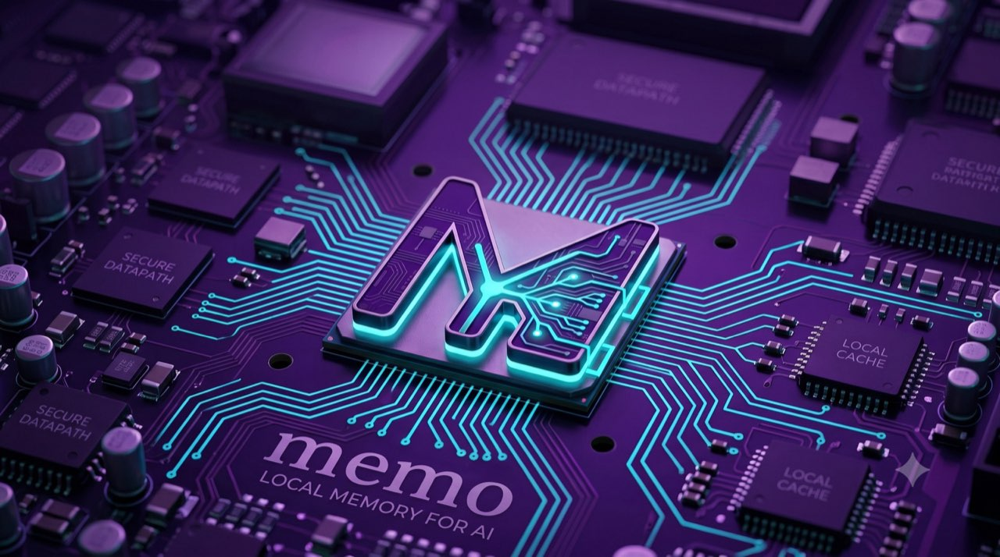
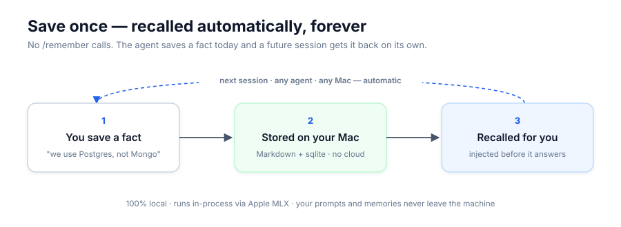
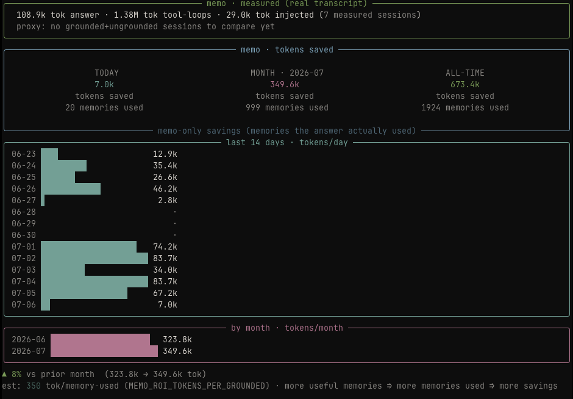
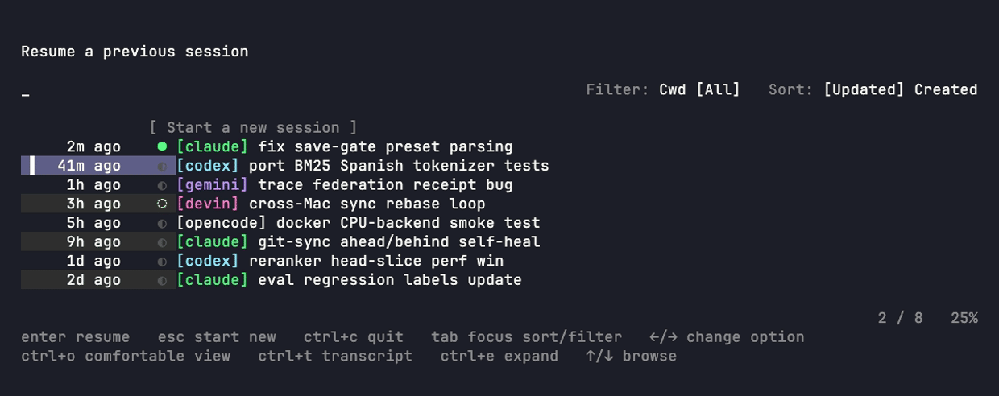
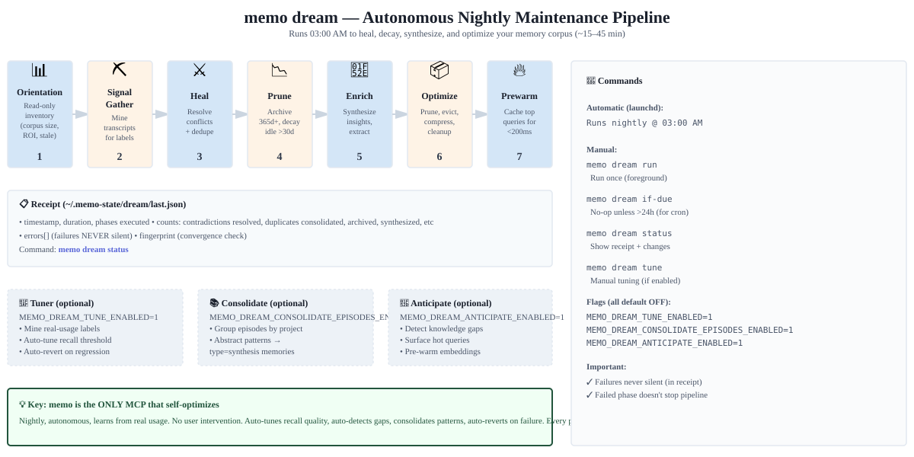
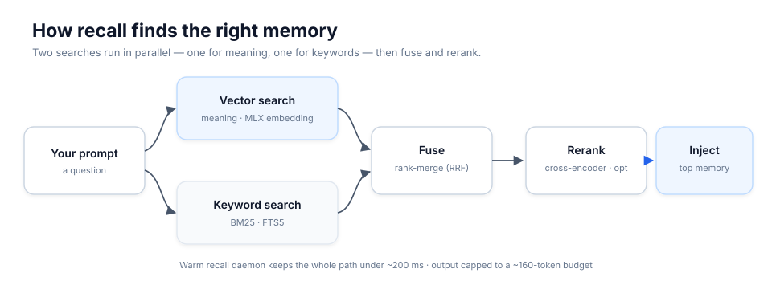
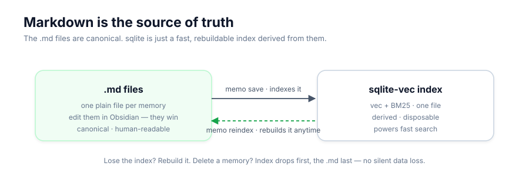

<div align="center">



# memo — MCP semantic memory server with MLX embeddings

**Local-first semantic memory for AI agents — with time-travel, contradiction radar, and automatic synthesis.**

**[Explore the memo website →](https://memo-web-sigma.vercel.app)**

[](https://pypi.org/project/mlx-memo/)
[](https://pepy.tech/project/mlx-memo)
[](https://pypi.org/project/mlx-memo/)
[](LICENSE)
[](https://modelcontextprotocol.io)
<a href="https://glama.ai/mcp/servers/jagoff/memo">
  
</a>

<br />
<br />

<a href="https://glama.ai/mcp/servers/jagoff/memo">
  
</a>

</div>

## What is memo?

**memo** is an MCP server for semantic memory. It gives any AI agent (Claude Code, Devin, Cursor, Cline) a persistent, searchable knowledge base that:

- Runs **100% locally** (macOS + Apple Silicon via MLX, or Linux/CPU)
- Uses **hybrid search** (vector embeddings + full-text search)
- Stores memories as **plain Markdown** (version-controllable, human-readable)
- Syncs **across machines** via serverless git
- Shares selected memories through **signed, ACL-scoped federation bundles**
- Detects & resolves **contradictions** automatically
- Builds a **knowledge graph** (entities + relations) you can query and reason over
- Learns which memories and procedures actually lead to successful outcomes
- Time-travels to any date (audit trail)

Normal local operation needs no Ollama, Qdrant, cloud API, or API key. Optional
federation uses a local signing key that you control.

## Install — one step

```bash
curl -fsSL https://raw.githubusercontent.com/jagoff/memo/v4.4.2/install.sh | bash
```

The installer auto-detects **uv** (preferred) or falls back to **pipx**. It downloads MLX models, and wires memo into every agent client it finds (Claude Code, Codex, Devin, Devin Desktop, OpenCode).

Prefer a manual install? Any of these expose the same two binaries — `memo` (CLI) and `memo-mcp` (MCP server):

```bash
uv tool install mlx-memo          # recommended
pipx install mlx-memo
brew tap jagoff/memo && brew install mlx-memo
```

> Keep memo **isolated as its own tool** (uv tool / pipx / Homebrew). Don't vendor it inside another project's `.venv`. `memo doctor --strict-runtime` verifies the install.

**On Linux, or just want to try it without installing anything?** Run the Docker
image (CPU backend on Linux — search/recall/save; the reranker + `ask`/
`synthesize`/`dream` verbs are Apple-Silicon-only):

```bash
docker run --rm ghcr.io/jagoff/memo:latest memo doctor
```

Details in **[docs/docker.md](docs/docker.md)**.

First install downloads ~8 GB of MLX models (5–15 min); later installs hit the HuggingFace cache. Full installer knobs and "move to a new Mac" steps: **[docs/reference.md › Install](docs/reference.md#install-detail)**.

**Migrating from another Mac?** Install first, then restore your corpus:

```bash
curl -fsSL https://raw.githubusercontent.com/jagoff/memo/v4.4.2/install.sh | bash
memo sync bootstrap git@github.com:yourname/memo-sync.git   # restore from git
```

### Memo 4: one independent memory runtime

Memo owns the full memory loop: durable Markdown records, retrieval, causal
operations, continuity, evidence, outcome feedback, lifecycle, and selective
exchange. It has no runtime dependency on Synapse, Memflow, sibling
repositories, or private contract packages.

- Every operational mutation enters a tamper-evident, hash-chained journal.
- `memo evidence "<question>"` returns a bounded `EvidencePack` or explicitly
  abstains when support is insufficient.
- `memo operational outcome record` connects task results to the memories used;
  repeated evidence can promote reusable procedures and failure patterns.
- `memo federation` exports only records visible to the named recipient and
  verifies signed bundles before importing them.
- `memo definitive check` audits those guarantees; `memo definitive benchmark`
  gates journal throughput.

Existing vaults remain Markdown-compatible. Legacy operational metadata is
translated one way into Memo-native contracts; it is never required at runtime.
See [Memo 4 independence and migration](docs/memo-4-independence.md).

### Measured results

Numbers from real command output on the author's live corpus (~4,900 memories, measured 2026-07-20). Methodology, reproduction commands, limitations, and an adversarial challenger review of these very claims: **[docs/BENCHMARK.md](docs/BENCHMARK.md)**.

| Metric | Result | Command |
|---|---|---|
| LongMemEval oracle (retrieval-only, 60 stratified questions) — recall@5 | 0.746 weighted micro | `memo eval bench` |
| Curated regression set — noise@5 (unfiltered config) | 0.00 | `memo eval recall` |
| Live recall hit rate (~1,230 hook fires, log window ~31 days) | 99% (97% strong) | `memo stats` |
| Tokens saved — estimated usage ledger, all-time | 1.21M (constants disclosed) | `memo tokens` |

### Local-first, offline by default

Every memory operation is offline by default and sends nothing to a hosted
service. The one default-on exception is **auto-update**: `memo-mcp` startup
makes a throttled `git ls-remote` tag probe (no memory content, paths, identity,
or IP) and installs a newer tagged release in the background so memo keeps itself
current. Set `MEMO_AUTO_UPDATE=0` to opt out and keep startup fully offline.
Statusline and hook self-healing remain explicit opt-ins, and startup does not
rewrite Claude or Codex configuration. Commands such as update and cross-machine
sync, plus requested model or benchmark downloads, may use the network. See the
[privacy and network policy](docs/privacy.md) for the exact flags and boundaries.

<!-- mcp-name: io.github.jagoff/memo -->

`memo` gives any MCP-aware agent (Claude Code, Codex, Devin, OpenCode, Cursor, Cline, Continue, …) a long-term memory that **runs entirely on your own machine** — **macOS on Apple Silicon** via [Apple MLX](https://github.com/ml-explore/mlx), or **Linux / Ubuntu on a CPU `sentence-transformers` backend** (see [docs/ubuntu.md](docs/ubuntu.md)). Each memory is a plain Markdown file; embeddings live in a single sqlite file; the embedder, reranker, and LLM run in-process — no Ollama, no Qdrant, no cloud API, no keys. Your prompts and memories never leave the machine.

<div align="center">



</div>

<div align="center">


</div>

## Why it pays for itself — in tokens

memo is built to **spend fewer tokens, not more**.

- **~80% smaller MCP surface.** The default `agent` profile exposes **38 tools / ~3.8k schema tokens**, versus **159 tools / ~18k tokens** for the full surface — that overhead is paid *every session, in every client*. memo keeps the default focused while including evidence, continuity, lifecycle, and outcome learning.
- **Recall injects the answer instead of re-deriving it.** Ambient recall surfaces the top memory *before* the agent answers, on a tight **~160-token budget**. The agent stops re-explaining what it already figured out last week.

On a ~200-memory corpus, `memo roi` estimates **~80k tokens of model work avoided** per session. The number is corpus-specific; it grows as memo learns more.

`memo tokens` tracks the savings in real-time:



| Technique | How to enable | Typical saving |
|---|---|---|
| Compact recall format | `export MEMO_RECALL_FORMAT=compact` | ~65% per injection |
| Trivial prompt gate | On by default | ~25% fewer injections |
| Context file compression | `memo compress-context CLAUDE.md` | 30–40% smaller context |

## What makes memo different

| Capability | memo | mem0 | letta | cognee | engram | basic-memory | cipher |
|---|:---:|:---:|:---:|:---:|:---:|:---:|:---:|
| 100% local (no cloud API) | ✅ | ⚠️ | ⚠️ | ⚠️ | ✅ | ✅ | ⚠️ |
| **Time-machine** (rewind corpus to any date) | ✅ | ❌ | ⚠️ | ❌ | ❌ | ⚠️ | ⚠️ |
| **Contradiction radar** (detect + resolve conflicts) | ✅ | ⚠️ | ⚠️ | ❌ | ⚠️ | ❌ | ❌ |
| **Synthesis pipeline** (auto-infer cross-cluster insights) | ✅ | ❌ | ✅ | ⚠️ | ❌ | ❌ | ⚠️ |
| **Cross-Mac git sync** (shared corpus, no server) | ✅ | ❌ | ⚠️ | ❌ | ✅ | ✅ | ⚠️ |
| Cloud sync (opt-in replication) | ✅ | ✅ | ✅ | ✅ | ✅ | ✅ | ✅ |
| **TUI** (terminal UI) | ✅ | ❌ | ⚠️ | ❌ | ✅ | ❌ | ✅ |
| Obsidian as source-of-truth | ✅ | ❌ | ⚠️ | ❌ | ❌ | ✅ | ❌ |
| Knowledge graph + entity extraction | ✅ | ✅ | ❌ | ✅ | ❌ | ✅ | ⚠️ |
| Eval regression gate (pre-commit wireable) | ✅ | ⚠️ | ⚠️ | ⚠️ | ❌ | ❌ | ❌ |
| Multi-modal (images, audio OCR) | ✅ | ⚠️ | ⚠️ | ✅ | ❌ | ❌ | ❌ |
| MCP surface profiles (token economy) | ✅ | ❌ | ❌ | ⚠️ | ⚠️ | ✅ | ❌ |
| **Passive capture** (auto-extract from transcripts) | ✅ | ⚠️ | ✅ | ✅ | ✅ | ❌ | ⚠️ |
| Session timeline (context before/after) | ✅ | ❌ | ❌ | ❌ | ✅ | ⚠️ | ⚠️ |

<sub>✅ first-class · ⚠️ partial, config-gated, or add-on · ❌ absent. Verified mid-2026 against each project's docs/repo: [mem0](https://github.com/mem0ai/mem0), [letta](https://github.com/letta-ai/letta) (formerly MemGPT), [cognee](https://github.com/topoteretes/cognee), [engram](https://github.com/Gentleman-Programming/engram), [basic-memory](https://github.com/basicmachines-co/basic-memory), [cipher](https://github.com/campfirein/cipher). Closest comparators: **basic-memory** (local-first + Obsidian + MCP — memo's exact thesis) and **cipher** (memory layer for coding agents).</sub>

## Use cases

- **Continuity across sessions.** Decide "we use Postgres, not Mongo" today; tomorrow, in a fresh session, the agent recalls it on its own — recall injects the decision *before* it answers, so you never re-explain it.
- **Shared memory across agents.** Save something while working in Claude Code; Codex, Cursor, or Cline pick it up later. They all read the same local store over MCP.
- **Memory that follows you across Macs.** Start on the laptop, continue on the desktop. The corpus travels over serverless git sync and the agent starts with the same context on both.
- **Preferences and conventions that stick.** "Tests first", "commit messages in English", "don't touch the auth module" — say it once, the agent applies it every future session.
- **Contradiction radar.** Change your mind on an old decision and memo flags the now-stale version — the agent won't reintroduce what you already discarded.
- **Time-machine / audit.** "What did we know about this bug last month?" Rewind the corpus to any date and see the state of knowledge at that point.
- **Instant project onboarding.** A cold agent gets the project's durable decisions, facts, and preferences up front via the session-start briefing.
- **Exact transcript lookup (opt-in).** `memo verbatim search` can find the precise wording of past local transcript turns through a private, lexical-only FTS5 index. It never enters ambient recall.
- **Fewer tokens, not more.** Instead of re-deriving what you solved last week, recall injects the answer on a tight budget — and the default MCP surface is 38 tools, not 159.

## Requirements

- **macOS on Apple Silicon** (M1–M4) — MLX is the load-bearing piece and the only path with the reranker + LLM features (ask / synthesize / dream).
- **Linux / Ubuntu** — supported as a **standalone** install via a CPU `sentence-transformers` backend (search + recall + save, no MLX). The install command in **[docs/ubuntu.md](docs/ubuntu.md)** uses the official PyTorch CPU index to avoid downloading CUDA libraries. Intel Macs are unsupported because current PyTorch releases do not ship Python 3.13 wheels for that platform.
- **~8 GB** free disk for the default model set (the installer downloads it).
- *Optional:* an Obsidian vault. Without one, memo defaults to `~/Documents/memo/`.

> Python ≥ 3.13 is required if you install without uv. The `curl | bash` installer handles this automatically — it detects `uv` and uses its managed Python if no system Python ≥ 3.13 is on PATH.

## Hand it to your agent

memo installs itself if you hand the repo (or just the install line) to an AI agent:

```bash
curl -fsSL https://raw.githubusercontent.com/jagoff/memo/v4.4.2/install.sh | bash
memo doctor --strict-runtime     # verify runtime is healthy
```

After install, tools surface as `mcp__memo__memo_*` (`memo_save`, `memo_search`, `memo_context`, `memo_ask`, `memo_get`, `memo_graph`, `memo_unified_briefing`, plus capture/session/version helpers on the default profile). Per-client setup (Claude Desktop, Cursor, Cline, Continue, manual JSON) is in **[docs/reference.md › MCP setup](docs/reference.md#mcp-setup)**.

## Quick start

```bash
memo doctor                                            # self-check: models, vault, sqlite-vec
memo setup --detect --dry-run                           # preview Codex/Claude Code wiring
memo config                                            # terminal-only configuration center
memo save 'MLX prefill ~30% faster than Ollama on M3 Max' --title 'MLX bench' -t mlx -t bench
memo search 'how fast was the MLX benchmark'           # search by meaning, not just keywords
memo list --limit 5                                    # most recent
memo ask 'what changed in the embedder this month?'   # RAG — cites memories by id
# Optional: build and query a private 90-day transcript index (no embeddings)
memo verbatim index
memo verbatim search 'exact deployment decision' --limit 10
```

`memo config` is a native TUI for editing every persistent setting with search,
source badges, validation, review, and transactional rollback. Markdown under
`~/.config/memo/` remains directly editable; `MEMO_*` variables are temporary
overrides. In pipes/CI or with `MEMO_NONINTERACTIVE=1`, bare `memo config` prints
help and the existing `config show|validate|set|unset` commands remain headless.

## Core features

- **Ambient recall** — every prompt silently consults memory and injects top hits as context. A warm recall daemon keeps it fast (p50 ~0.6 s on the benchmark corpus — see [docs/BENCHMARK.md](docs/BENCHMARK.md)). No `/remember` calls.
- **Auto-capture** — a `Stop` hook extracts durable insights from each exchange through a quality gate. The corpus grows on its own.
- **Session briefing** — `SessionStart` surfaces open loops, a memory of the day, and one-line crash recovery.
- **Cross-agent resume** — `memo resume` reopens any recent session from **any** agent (Claude Code, Codex, Devin, Gemini, OpenCode) in one arrow-key picker, resumed natively. [Details ↓](#-resume-any-session--from-any-agent)
- **Visible memory context** — `memo context "<question>"` (and the `memo_context` MCP tool) show exactly what memory *would* be injected before an agent answers — the recall block on demand, with no LLM call. Add `--explain` to `memo search` to see why each hit ranked where it did.
- **Knowledge graph** — entities and semantic relations extracted from every memory; query it (`memo graph neighbors/path/why`, `memo_graph` MCP tool) or let it boost recall ranking (opt-in). [Details ↓](#-knowledge-graph)

## Key capabilities

### 🔀 Resume any session — from any agent

`memo resume` opens one arrow-key picker over **every** recent coding session on the machine — Claude Code, Codex, Devin, Gemini, and OpenCode — merged with memo's own recall-grounded snapshots. Crashed, closed the terminal, or switched agents mid-task? Reopen the project, run one command, and continue exactly where any of them left off.

<div align="center">



</div>

```bash
memo resume                               # picker across all agents (↑/↓ browse, type to search, Enter resumes)
memo resume --all-cwd                      # widen beyond the current project
memo resume 019f51e9                       # jump straight to one session by id / prefix
memo episodes search "vec0 timeout bug"    # find a past session by meaning, not recency
```

Each row resumes **natively** in its own agent — `claude --resume`, `codex resume`, `devin -r`, `gemini --session-file`, `opencode --session` — so control returns to that agent's real session, not a copy. Type-to-search re-ranks by *meaning* over the full session history (episodic memory); `Tab` toggles the cwd/all filter and the updated/created sort. Any agent that writes a transcript is discovered automatically — nothing to configure.

### 🕰️ Time-machine

Rewind the corpus to any past date and query it as it was then:

```bash
memo as-of ask "what was the deployment strategy?" --date 2026-02-01
memo as-of search "redis config" --date 2026-01-15
memo diff --from 2026-01-01 --to 2026-03-01    # what changed
```

No other agent-memory system offers this. Full historical reconstruction via reverse-replay of `history.db`.

### ⚡ Contradiction radar

```bash
memo contradict scan                  # detect conflicting facts corpus-wide
memo contradict triage                # resolve interactively: fuse / newer-wins / dismiss
memo review due                       # explicit freshness obligations; never auto-invalidates
```

Eligible decision, preference, policy, configuration, and architecture saves
now generate up to three namespace-safe relation candidates by default, without
an LLM call. Judged relations are attached to normal search/ask results; pending
candidates stay confined to review surfaces. The full MCP profile exposes
`mem_relation_reviews`, `mem_judge`, and `mem_compare`. Set
`MEMO_RELATION_CANDIDATES_ENABLED=0` or
`MEMO_RELATION_ANNOTATIONS_ENABLED=0` to opt out independently.

The LLM-backed corpus scanner can classify additional candidate pairs. Results
persist as canonical relations in the main rebuildable index; legacy
`contradictions.db` data is imported once and remains readable during the
compatibility window.

### 🔮 Synthesis & autonomous maintenance

#### Synthesis

```bash
memo synthesize                       # generate cross-cluster insights (LLM)
```

`MEMO_SYNTHESIS_ENABLED=1` runs synthesis automatically during `memo maintain`, creating type=`synthesis` memories from inferred cross-cluster patterns. Memories are cited with their source cluster.

#### Dream — 7-phase autonomous maintenance

`memo dream` runs nightly (03:00 AM by default) as a **fully autonomous pipeline** that synthesizes insights, resolves contradictions, decays old memories, and optimizes the corpus — with zero user intervention:

```bash
memo dream run                 # run once (foreground)
memo dream status              # show receipt + changes made
memo dream if-due              # no-op unless > 24h since last run (for cron)
```

The 7 phases: **(1) Orientation** (inventory corpus), **(2) Signal gather** (mine transcript labels), **(3) Heal** (resolve conflicts + consolidate duplicates), **(4) Prune** (archive 365d+ untouched, decay idle >30d), **(5) Enrich** (synthesize cross-cluster insights, extract entities), **(6) Optimize** (prune low-quality, evict if full, compress context), **(7) Prewarm** (cache top-100 query embeddings for <200ms recall next session).

Every phase logs to a **receipt** (`<state_dir>/dream/last.json` — `~/.local/share/memo/dream/last.json` by default): timestamp, duration, phase counts (resolved, consolidated, archived, synthesized, etc.), and any errors. Failures never silently vanish — they live in the receipt. A failed phase doesn't stop the pipeline; subsequent phases run anyway.

<div align="center">



</div>

**Optional self-improvement** (all default OFF):

- **Tuner** (`MEMO_DREAM_TUNE_ENABLED=1`) — mines ground-truth labels from real usage, auto-tunes `MEMO_RECALL_MIN_SIM`, auto-reverts if eval baseline regresses. `memo dream tune`.
- **Consolidate** (`MEMO_DREAM_CONSOLIDATE_EPISODES_ENABLED=1`) — abstracts recurring cross-session work into synthesis memories. `memo dream consolidate-episodes`.
- **Anticipate** (`MEMO_DREAM_ANTICIPATE_ENABLED=1`) — surfaces unmet gaps + hot queries, pre-warms their embeddings. `memo dream anticipate`.

memo is the **only MCP memory system that self-optimizes**: auto-tuning recall quality, auto-detecting gaps, consolidating patterns — all from real usage, all nightly, all without asking.

### 🌐 Cross-Mac git sync

```bash
memo sync bootstrap git@github.com:yourname/memo-sync.git   # wire a shared corpus
memo sync once                                                # push/pull now
```

Pull-rebase-before-push. `flock`-based single owner per machine. Async debounced hooks keep the corpus current without blocking.

### 📚 Obsidian vault as source-of-truth

```bash
MEMO_MEMORIES_IN_VAULT=1 memo init                # store memories inside your vault
memo migrate --into-vault                          # non-destructive migration
```

Human edits in Obsidian win on the next `memo reindex`. The sqlite index is always rebuildable from the `.md` files.

### 🕸️ Knowledge graph

```bash
memo graph neighbors "MLX"             # what's related
memo graph path "embedder" "reranker"  # how two concepts connect
memo graph why "mlx" "daemon"          # weighted path + evidence memories
memo graph hubs                        # broad entities that may act as hubs
memo graph relations rebuild           # deterministic semantic-relation backfill
memo graph rebuild --json              # atomically rebuild the curated projection
memo graph stats --json                # active version, freshness, rejections
memo graph trace --memory abc123 --json # memory → stable code references
memo graph trace --code src/memo/graph.py --json # code → supporting memories
memo graph discover --include-code     # curated communities + bridges + evidence
memo search "mlx daemon" --explain     # ranking reasons, including graph signal when enabled
memo entities                          # list extracted entities
memo links --id abc123                 # backlinks + outlinks
```

Entity extraction uses a dependency-free regex backend. For code-heavy
work, memo resolves capture-stamped files and explicit references against
**[codegraph](https://github.com/colbymchenry/codegraph)** and projects stable
`codegraph://<repo>/<symbol>` references. This keeps code symbols distinct from
knowledge entities while making memory↔code evidence queryable in both
directions.

Graph ranking serves a versioned curated projection and is opt-in,
hub-suppressed, deadline-bounded, and fail-open. Activate it persistently with
`memo config set graph.projection_enabled true`, `memo config set
graph.signal_enabled true`, and `memo config set graph.reason_enabled true`;
these settings live in `graph-config.md`. `memo eval recall --graph-ab`
compares identical recall configs with the curated signal off/on before it
becomes part of a gate.

`graph.code_trace_enabled`, `graph.discovery_enabled`,
`graph.dream_communities_enabled`, and `graph.dream_bridges_enabled` live in
that same Markdown file. Discovery and synthesis use the active curated
projection only; they never silently fall back to the raw graph.

### 🧩 Temporal facts

```bash
memo temporal facts add postgres is "primary datastore" --valid-at 2026-01-01
memo temporal facts list --as-of 2026-03-01     # facts live at that date
```

memo extracts subject–predicate–object **fact edges** from your memories and fuses a temporal fact-edge leg into hybrid search via RRF (`MEMO_FACT_RETRIEVAL_ENABLED`, on by default; weight `MEMO_FACT_RETRIEVAL_WEIGHT=0.6`). Query-relevant facts attach to search/ask results (`MEMO_FACT_SURFACE_ENABLED`) and surface in the SessionStart briefing's **Temporal facts** section. Every edge carries validity windows (`--valid-at` / `--invalid-at` / `--expired-at`) so `list --as-of <date>` returns only what was true then. Disable with `MEMO_FACT_RETRIEVAL_ENABLED=0`.

### 🏥 Health scoring & eval gates

```bash
memo health                                         # grounded rate, ROI, usefulness verdict
memo eval recall --labels eval/regression_labels.json --k 5
memo eval recall --gate                             # exit non-zero if precision drops
memo eval recall --update-baseline                  # snapshot current best
memo eval memory --labels eval/regression_labels.json # quality suite: recall, staleness, graph and latency
```

Wire `--gate` into a pre-commit hook to catch retrieval regressions before they ship. Recall eval also reports graph diagnostics (`graph_recall_gain`, `graph_noise_rate`, `graph_explanation_coverage`, `hub_noise_rate`, `latency_ms_graph`) when graph attribution is present, but the hard gate remains precision/noise. `memo feedback` records per-source 👍/👎 votes that teach the retriever which memories to surface (or hide) for similar queries.

### 🖼️ Multi-modal ingestion

```bash
memo ocr-image screenshot.png                         # one-shot macOS Vision OCR
MEMO_VLM_CAPTION_ENABLED=1 memo ingest ~/Vault --include-orphan-images
memo ingest ~/Vault --include-audio                   # mlx-whisper, optional
memo search "whiteboard diagram"                      # finds OCR/caption/transcript text
```

The old placeholder `memo multimodal` store was removed; images and audio now
become searchable by flowing OCR, VLM captions, and whisper transcripts through
the normal text index.

### 🔐 Secret storage

```bash
export MEMO_SECRET_STORAGE_ENABLED=1                     # explicit opt-in
memo secret save --name openai-api-key --kind api_token   # value read from stdin
memo secret get --name openai-api-key                       # decrypt one secret
memo secret list                                            # names only, never values
```

Secret storage is **off by default** and requires `MEMO_SECRET_STORAGE_ENABLED=1`. Values are sealed with AES-256-GCM plus authenticated name/kind metadata under a random 256-bit master key at `$MEMO_STATE_DIR/secret-master.key`; memo enforces a private state directory (`0700`) and key/database permissions (`0600`). Credentials live only in the isolated `secret_store` table: no markdown marker is created, and they are never indexed, embedded, recalled, added to generated context, backed up as memory markdown, or committed by memo's git sync. `memo secret list` exposes metadata only. Treat `memo secret get` and `memo secret export` as explicit plaintext disclosure operations and redirect their output carefully.

### Daemons

memo runs four background daemons:

| Daemon | Command | Purpose |
|---|---|---|
| recall-daemon | `memo recall-daemon start` | Warm MLX embedder over socket (<200 ms recall) |
| idle-daemon | auto-started by `memo-mcp` | Auto-capture for MCP-only clients (Devin, OpenCode) |
| ingest-daemon | `memo ingest-daemon start` | Bulk vault ingestion |
| maint-daemon | `memo maint-daemon start` | Background cleanup + synthesis |

### All 134 top-level CLI commands

<details>
<summary>Click to expand</summary>

**Core:** `save` `search` `ask` `get` `edit` `rename` `delete` `list`

**Recall & Hooks:** `recall` `recall-hook` `context` `briefing` `continuity` `prewarm` `capture-tick` `capture-stop` `interject` `ask-gaps` `guard` `digest`

**Session & History:** `history` `as-of` `diff` `record-history` `session` `resume` `reflect` `mine-history` `episodes` `chronicle`

**Maintenance:** `reindex` `maintain` `review` `dream` `consolidate` `synthesize` `dedupe` `retier` `contradict` `invalidate` `temporal` `compress-context`

**Analysis & Quality:** `health` `stats` `doctor` `journey-check` `lint` `drift` `analytics` `eval` `roi` `tokens` `token-savings` `usefulness` `gaps` `outcome` `profile` `confidence` `graduation` `hype` `definitive` `evidence`

**Knowledge Graph:** `graph` `entities` `entity` `extract-entities` `links` `version` `related`

**Advanced Search:** `embed` `rerank` `contextual` `retrieve` `context-pack` `chat` `chat-ask` `repo`

**Import / Export / Sync:** `import` `export` `backup` `restore` `sync` `ingest` `federation`

**Visualization:** `tui` `dashboard` `map` `logs` `hook-log`

**Setup & Config:** `init` `setup` `config` `install-mcp` `install-watcher` `uninstall-watcher` `install-slash` `install-statusline` `install-recall-hook` `install-shell-wrapper` `install-shims` `startup-banner` `migrate` `migrate-vault` `migrate-independence` `update` `upgrade` `self-update` `watch` `release` `onboard`

**Daemons:** `recall-daemon` `ingest-daemon` `maint-daemon` `embed-daemon` `idle-daemon`

**Other:** `backend-native` `collaborative` `feedback` `query` `mandate` `drift` `sleep-cycle` `operational` `ocr-image` `provenance` `secret` `verbatim` `mcp-command` `codex-badge` `debug-recall` `http-api` `mine-git` `token-gate` `fix` `undo`

</details>

### MCP surface profiles

| Profile | Tools | Schema tokens | Use when |
|---|---|---|---|
| `agent` (default) | 38 | ~3.8k | Standard agent work — lifecycle, evidence, continuity, profile, learning |
| `core` / `slim` | 55 | ~5.0k | Constrained clients (Codex, OpenCode), admin-lite |
| `agent` (default) | 38 | ~3.8k | Essential memory, lifecycle, evidence |
| `core` / `slim` | 55 | ~5.0k | CRUD, history, sessions, lint |
| `full` / `default` | 159 | ~18k | Power users, debugging |

Set via `MEMO_MCP_PROFILE=full` or in each client's MCP env config.

Non-MCP clients: `memo http-api` serves the same operations as a localhost REST API (plain JSON). Every `/api/*` route requires `Authorization: Bearer <token>`; only `/health` is public. The first run creates a private token at `$MEMO_STATE_DIR/http-api-token` (normally `~/.local/share/memo/http-api-token`), or you can provide a 32+ character `MEMO_HTTP_API_TOKEN`. Both REST and MCP HTTP reject non-loopback binds unless explicitly acknowledged, never allow unauthenticated non-loopback exposure, add defensive response headers, and limit each source to 300 requests per minute per process.

```bash
memo http-api
curl -H "Authorization: Bearer $(tr -d '\n' < ~/.local/share/memo/http-api-token)" \
  http://127.0.0.1:8080/api/stats
```

For an authenticated network bind, use `memo http-api --host 0.0.0.0 --allow-non-loopback`; for MCP set `MEMO_MCP_TRANSPORT=http`, `MEMO_MCP_HOST=0.0.0.0`, and `MEMO_MCP_ALLOW_NON_LOOPBACK=1`. Use TLS or a trusted reverse proxy whenever traffic leaves the machine. `--allow-no-auth` / `MEMO_MCP_ALLOW_NO_AUTH=1` exist only for explicit loopback development.

## Retrieval architecture

**Hybrid search:** vec leg (MLX embedding on Apple Silicon, CPU `sentence-transformers` on Linux) + BM25 leg (FTS5/Tantivy, diacritic-folding for Spanish) fused via Reciprocal Rank Fusion → optional MLX cross-encoder rerank (Apple Silicon).

<div align="center">



</div>

**Markdown is the source of truth.** The `.md` files are canonical; sqlite is a rebuildable index. A hand-edit in Obsidian wins on the next `memo reindex`. `delete()` removes the index first, then the file — no silent data loss.

<div align="center">



</div>

**Embedding models:**

| Model | Dims | Disk | Use |
|---|---|---|---|
| `Qwen3-Embedding-0.6B-4bit` | 1024 | ~0.6 GB | Default (fast, good) |
| `Qwen3-Embedding-4B-4bit` | 2560 | ~3 GB | Higher recall quality |
| `Qwen3-Embedding-8B-4bit` | 4096 | ~5 GB | Maximum quality |

Switch with `MEMO_EMBEDDER_MODEL` + its exact 40-character
`MEMO_EMBEDDER_REVISION` + `MEMO_EMBEDDER_DIMS` (requires
`memo reindex --rebuild`). Audited built-in models already carry immutable pins.

## Documentation

| Topic | Where |
|---|---|
| Full install detail, installer knobs, new-Mac migration | [docs/reference.md › Install](docs/reference.md#install-detail) |
| Per-client MCP setup + the `/memo` slash command | [docs/reference.md › MCP setup](docs/reference.md#mcp-setup) |
| MCP profile tools and advanced domains | [docs/reference.md › MCP tools](docs/reference.md#mcp-tools) |
| Ambient memory, recall daemon, capture & recall tuning | [docs/reference.md › Ambient memory](docs/reference.md#ambient-memory) |
| Time-machine, session briefing, semantic map | [docs/reference.md › Surfaces](docs/reference.md#surfaces) |
| Full CLI reference + live dashboard (`memo tui`) | [docs/reference.md › CLI](docs/reference.md#cli-reference) |
| Stable/common `MEMO_*` flags, model profiles, upgrading the embedder | [docs/reference.md › Configuration](docs/reference.md#configuration) |
| Architecture, sync tiers, design notes | [docs/reference.md › Design & comparison](docs/reference.md#design-and-comparison) |

Contributors: `git clone https://github.com/jagoff/memo && cd memo && uv pip install -e '.[dev]'`. See [CONTRIBUTING.md](CONTRIBUTING.md).

## Privacy

memo is **local-first**: everything you save is stored on your own machine as
markdown files plus a rebuildable SQLite index. Embeddings and any LLM steps run
in-process (MLX / CPU) — **no cloud API, no keys, no telemetry**. The only way
memory leaves your device is if **you** configure a git `memo-sync` remote you
own. Full detail: [PRIVACY.md](PRIVACY.md).

## License & provenance

MIT — see [LICENSE](LICENSE). Forked philosophically from [`mem-vault`](https://github.com/jagoff/mem-vault) (storage layout + frontmatter schema); the MLX backend pieces are ported from [`obsidian-rag`](https://github.com/jagoff/rag-obsidian). Memo is a standalone system: runtime, state, trust, recovery, and federation are all owned within this repository.
