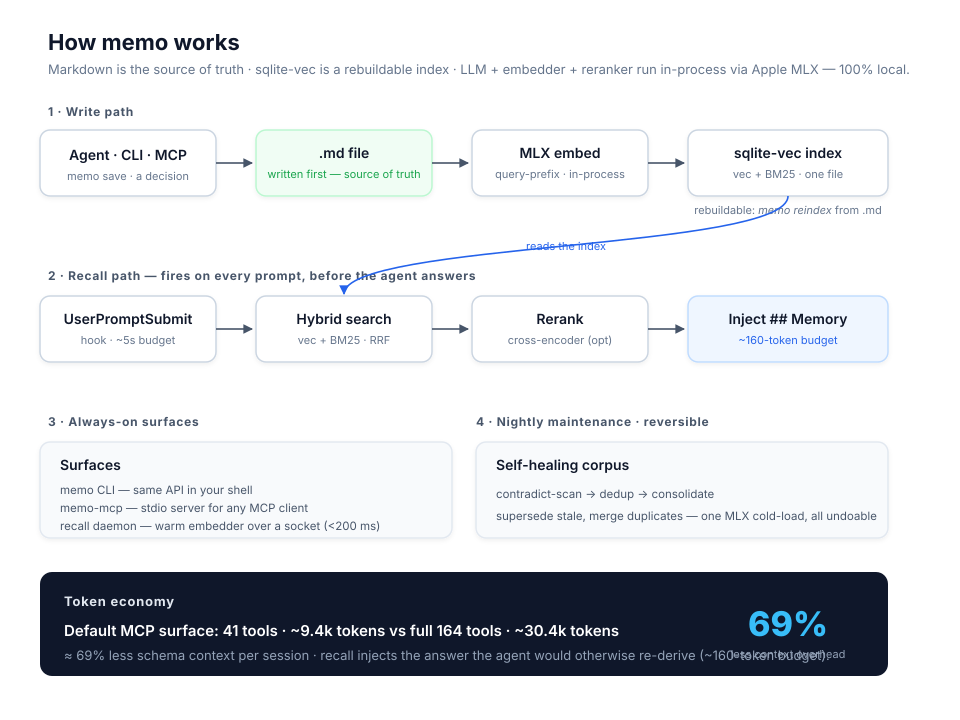

<div align="center">

# memo

**Persistent semantic memory for AI agents — 100% local, MLX-native, Apple Silicon.**

[](https://pypi.org/project/mlx-memo/)
[](https://pypi.org/project/mlx-memo/)
[](LICENSE)
[](https://modelcontextprotocol.io)

</div>

<!-- mcp-name: io.github.jagoff/memo -->

`memo` gives any MCP-aware agent (Claude Code, Codex, Devin, OpenCode, Cursor, Cline, Continue, …) a long-term memory that **runs entirely on your Mac**. Each memory is a plain Markdown file in an Obsidian-friendly folder; embeddings live in a single sqlite file; the LLM, embedder, and reranker run **in-process via [Apple MLX](https://github.com/ml-explore/mlx)** — no Ollama, no Qdrant, no cloud API, no keys. Your prompts and memories never leave the machine.



## Why it pays for itself — in tokens

memo is built to **spend fewer tokens, not more**. Two measured wins (real numbers from the shipped build, commits `ee78f05` + `1ad7bdf`):

- **96.4% smaller MCP surface.** The default `agent` tool profile exposes **5 tools / ~589 schema tokens**, versus **118 tools / ~16,157 tokens** for a full surface — that overhead is paid *every session, in every client*. memo trims it to almost nothing. (`core` profile = 25 tools, ~2.4k vs ~35k tokens.)
- **Recall injects the answer instead of re-deriving it.** Ambient recall surfaces the top memory *before* the agent answers, on a tight **~160-token budget**, with the directive sent only on the first turn. The agent stops re-explaining what it already figured out last week.

On a ~200-memory corpus, memo's ROI meter estimates **~80k tokens of model work avoided** (≈62.6k from 179 grounded facts + ≈17.1k from 19 re-asks it prevented; ~259 tokens/response). The estimate is corpus-specific — `memo roi` shows yours.

## Requirements

- **macOS on Apple Silicon** (M1–M4) — MLX is the load-bearing piece. memo does **not** run on Linux / Windows / Intel Macs.
- **Python ≥ 3.13**.
- **~8 GB** free disk for the default model set (the installer downloads it).
- *Optional:* an Obsidian vault. Without one, memo defaults to `~/Documents/memo/`.

## Install — one step

```bash
# One-line installer: pipx under the hood, installs GitHub master,
# downloads MLX models, and wires up Claude Code / Codex / OpenCode / Windsurf.
curl -fsSL https://raw.githubusercontent.com/jagoff/memo/master/install.sh | bash
```

Prefer a published release? Any of these work and expose the same two binaries — `memo` (CLI) and `memo-mcp` (MCP server):

```bash
pipx install mlx-memo
uv tool install mlx-memo
brew tap jagoff/memo && brew install mlx-memo
```

> Keep memo **isolated as its own tool** (pipx / uv tool / Homebrew). Don't vendor it inside another project's `.venv` — its MLX runtime, model cache, sqlite state, and `memo-mcp` should move together as one subsystem. `memo doctor --strict-runtime` verifies the install.

First install downloads ~7 GB of MLX models (5–15 min); later installs hit the HuggingFace cache. Full installer knobs, model list, and "move to a new Mac" steps live in **[docs/reference.md](docs/reference.md#install-detail)**.

## Hand it to your agent

memo is designed so you can give the repo (or just the install line) to an AI coding agent and it installs itself. The whole setup is three commands:

```bash
curl -fsSL https://raw.githubusercontent.com/jagoff/memo/master/install.sh | bash
memo doctor --strict-runtime          # verify the runtime is healthy
memo install-slash                    # register MCP + /memo for every client found
```

`memo install-slash` configures **Claude Code, Codex, Devin, Windsurf, and OpenCode** where each supports it — it writes the MCP server entry (pinned to the absolute `memo-mcp` path) and the `/memo` skill, forwarding your `MEMO_*` env so GUI clients inherit the right model profile. Per-client setup (Claude Desktop, Cursor, Cline, Continue, manual JSON) is in **[docs/reference.md](docs/reference.md#mcp-setup)**.

After install, tools surface inside the agent as `mcp__memo__memo_*` (`memo_save`, `memo_search`, `memo_ask`, `memo_get`, `memo_unified_briefing`).

## Quick start

```bash
memo doctor                                  # self-check: models, vault path, sqlite-vec
memo save 'MLX prefill ~30% faster than Ollama on M3 Max' --title 'MLX bench' -t mlx -t bench
memo search 'how fast was the MLX benchmark'  # search by meaning, not just keywords
memo list --limit 5                          # most recent
memo ask 'what changed in the embedder this month?'   # RAG — cites memories by id
```

## What you get

- **Ambient recall** — with the Claude Code plugin, every prompt silently consults memory and injects the top memories as context, with a warm **recall daemon** (<200 ms). No `/remember` calls.
- **Auto-capture** — a `Stop` hook extracts durable insights from each exchange through a quality gate and saves them. The corpus grows on its own.
- **Session briefing** — `SessionStart` surfaces open loops, a memory of the day, and one-line crash recovery for the last session.
- **Resilient daemon communication** — Socket clients use exponential backoff (3 retries) on connection failures to the recall daemon, preventing transient blips from degrading recall.
- **Operational safety toggles** — `MEMO_TANTIVY_ENABLED=0` disables Tantivy dual-write; `MEMO_SOFT_DELETE=0` bypasses soft-delete (permanent row removal); `MEMO_DEDUP_EXACT=0` disables exact-content deduplication; `MEMO_CONTRADICTION_TIMEOUT` controls LLM timeout for contradiction detection.
- **Vacuum cleanup** — `memo maintain --vacuum --vacuum-days 90` permanently purges soft-deleted records older than the threshold, keeping the store lean. WhatsApp ingest flags (`WHATSAPP_BOT_JID`, `WA_LISTENER_NOTES_CHAT_JID`) are configurable via `MEMO_*` env or `memo config flags`.
- **🕰️ Time-machine** — rewind the corpus to any past date: `memo as-of ask "..." --date 2026-02-01`, `memo diff --from … --to …`. No other agent-memory store offers this.
- **Hybrid retrieval + reranker** — vec + BM25 (FTS5, Tantivy optional, diacritic-folding for Spanish) fused via RRF, then an optional MLX cross-encoder rerank. Tantivy dual-write can be disabled with `MEMO_TANTIVY_ENABLED=0` for operational safety.
- **Markdown is the source of truth** — plain `.md` + frontmatter you can edit in Obsidian/vim; the sqlite index is rebuildable (`memo reindex`).
- **Semantic map** — `memo map` renders an interactive 2D canvas (UMAP/PCA + Plotly) of the whole corpus.
- **Contradiction tracking** — `memo temporal contradictions <entity>` detects conflicting facts over time. LLM timeout configurable via `MEMO_CONTRADICTION_TIMEOUT` (default 30s).

## Documentation

The README is the front door; the full manual lives in `docs/`.

| Topic | Where |
|---|---|
| Full install detail, installer knobs, new-Mac migration | [docs/reference.md › Install](docs/reference.md#install-detail) |
| Per-client MCP setup + the `/memo` slash command | [docs/reference.md › MCP setup](docs/reference.md#mcp-setup) |
| Tools exposed over MCP | [docs/reference.md › MCP tools](docs/reference.md#mcp-tools) |
| Ambient memory, recall daemon, capture & recall tuning | [docs/reference.md › Ambient memory](docs/reference.md#ambient-memory) |
| Session briefing, semantic map, time-machine | [docs/reference.md › Surfaces](docs/reference.md#surfaces) |
| Full CLI reference + live dashboard (`memo tui`) | [docs/reference.md › CLI](docs/reference.md#cli-reference) |
| All `MEMO_*` configuration, model profiles, upgrading the embedder | [docs/reference.md › Configuration](docs/reference.md#configuration) |
| Design notes & how memo compares to mem0 / letta / cognee / … | [docs/reference.md › Design & comparison](docs/reference.md#design-and-comparison) |
| Architecture / install / ambient-loop / time-machine diagrams | [docs/architecture.svg](docs/architecture.svg) · [install-flow](docs/install-flow.svg) · [ambient-loop](docs/ambient-loop.svg) · [time-machine](docs/time-machine.svg) |

Contributors: `git clone https://github.com/jagoff/memo && cd memo && uv pip install -e '.[dev]'`. See [CONTRIBUTING.md](CONTRIBUTING.md).

## License & provenance

MIT — see [LICENSE](LICENSE). Forked philosophically from [`mem-vault`](https://github.com/jagoff/mem-vault) (storage layout + frontmatter schema); the MLX backend pieces are ported from [`obsidian-rag`](https://github.com/jagoff/rag-obsidian). memo is one of three sovereign systems in a wider stack ([Memflow](https://github.com/jagoff/memflow), Synapse) — the integration is opt-in everywhere; single-Mac users see zero behaviour change.

---

## Español

**memo** es memory semántica persistente para agentes de IA: **100% local**, sobre Apple Silicon con MLX. Cada memory es un archivo Markdown; los embeddings viven en un único sqlite; el LLM, el embedder y el reranker corren **en proceso vía MLX** — sin Ollama, sin nube, sin API keys. Tus prompts y memories **nunca salen de la Mac**.

**Por qué ahorra tokens:** la superficie MCP por defecto son 5 tools (~589 tokens) contra 118 (~16.157) → **96,4% menos** contexto por sesión; y el recall **inyecta la respuesta** (presupuesto ~160 tokens) en vez de que el agente la vuelva a deducir. En un corpus de ~200 memories, `memo roi` estima **~80k tokens de trabajo del modelo evitados**.

**Token economy — techniques that reduce session cost:**

| Technique | How to enable | Typical saving |
|---|---|---|
| Compact recall format | `export MEMO_RECALL_FORMAT=compact` | ~65% per injection |
| Trivial prompt gate | On by default | ~25% fewer injections |
| Context file compression | `memo compress-context CLAUDE.md` | 30–40% smaller context |

Run `memo token-savings` to see your session's recall injection stats.

**Instalación en un paso:**

```bash
curl -fsSL https://raw.githubusercontent.com/jagoff/memo/master/install.sh | bash
memo doctor --strict-runtime    # verifica el runtime
memo install-slash              # registra el MCP + /memo en Claude Code, Codex, Devin, Windsurf, OpenCode
```

Requisitos: **macOS en Apple Silicon** (M1–M4), **Python ≥ 3.13**, ~8 GB de disco para los modelos. La documentación completa está en inglés en **[docs/reference.md](docs/reference.md)**.
