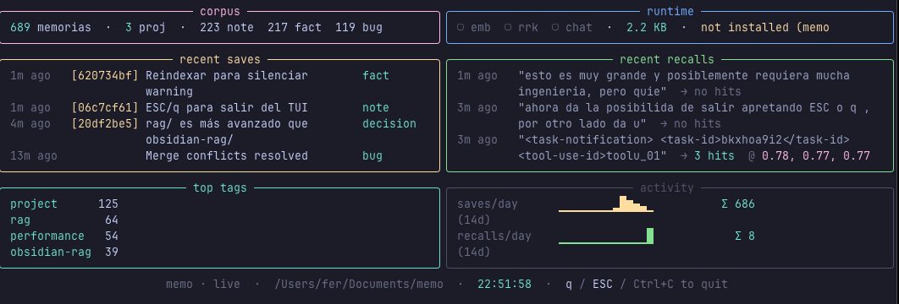
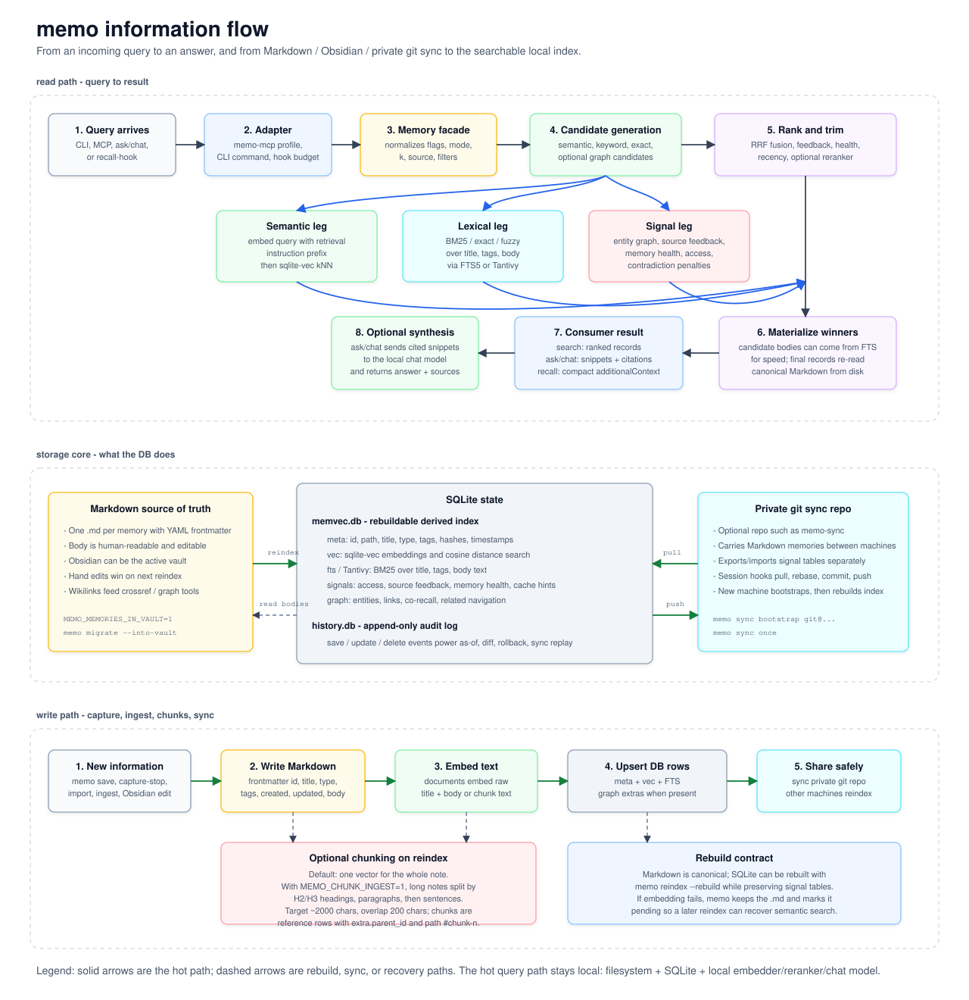

# memo — reference manual

The [README](../README.md) is the front door. This is the full manual: install
detail, per-client MCP setup, the profiled MCP and CLI surfaces, the stable and
commonly tuned `MEMO_*` knobs, design notes, and how memo compares to other
agent-memory projects. For the complete live flag registry, run
`memo config flags`.

- [Install detail](#install-detail)
- [MCP setup](#mcp-setup)
- [MCP tools](#mcp-tools)
- [Ambient memory](#ambient-memory)
- [Surfaces](#surfaces) — session briefing, semantic map, time-machine
- [CLI reference](#cli-reference)
- [Configuration](#configuration)
- [Design and comparison](#design-and-comparison)
- [Information flow diagram](#information-flow-diagram)

---

## Install detail

Recommended install: keep memo isolated as its own tool. Do **not** vendor it
inside another project's `.venv`; the MLX runtime, model cache, MCP server,
sqlite state, and CLI should move together as one subsystem.

```bash
# One-line installer (uv/pipx under the hood, pins the matching release,
# and configures Claude Code + Codex + OpenCode + Devin Desktop when available)
curl -fsSL https://raw.githubusercontent.com/jagoff/memo/v4.1.0/install.sh | bash
# or install the latest published PyPI release explicitly
pipx install mlx-memo
# or
uv tool install mlx-memo
# or via the Homebrew tap
brew tap jagoff/memo && brew install mlx-memo
```

Any of those expose two binaries: `memo` (CLI) and `memo-mcp` (MCP server). For
MCP clients, prefer an isolated tool install so memo's MLX dependencies, sqlite
state, and `memo-mcp` runtime stay independent from whichever repo is active in
your shell.

> The PyPI distribution is **`mlx-memo`** as of 0.5.0. Earlier versions shipped
> as `memo-mcp`; the binary names haven't changed, so existing MCP configs keep
> working. The one-line installer pins the package version matching the script's
> release tag. Development checkouts remain available through `MEMO_INSTALL_SPEC`.

If you are developing this repo and want the real system install to use your
checkout:

```bash
pipx install --force /path/to/memo
memo doctor --strict-runtime
memo --version
```

### Installer knobs

```bash
# Install the latest published PyPI release instead of GitHub master.
curl -fsSL https://raw.githubusercontent.com/jagoff/memo/v4.1.0/install.sh | MEMO_INSTALL_FROM_PYPI=1 bash

# Pin a published PyPI version.
curl -fsSL https://raw.githubusercontent.com/jagoff/memo/v4.1.0/install.sh | MEMO_VERSION=0.6.0 bash

# Install from an explicit pipx spec (local checkout, git ref, wheel, etc.).
MEMO_INSTALL_SPEC=/path/to/memo ./install.sh

# Skip agent-client configuration during install.
curl -fsSL https://raw.githubusercontent.com/jagoff/memo/v4.1.0/install.sh | MEMO_INSTALL_SKIP_AGENT_CONFIG=1 bash

# Force-skip the MLX model download (models load lazily on first use).
curl -fsSL https://raw.githubusercontent.com/jagoff/memo/v4.1.0/install.sh | MEMO_INSTALL_DOWNLOAD_MODELS=no bash

# Force-yes the MLX model download (skip the interactive confirmation).
curl -fsSL https://raw.githubusercontent.com/jagoff/memo/v4.1.0/install.sh | MEMO_INSTALL_DOWNLOAD_MODELS=yes bash
```

**Model download** is part of memo's structure (embedder + reranker + chat
models are required for retrieval and ambient recall). On an interactive
terminal the installer asks for confirmation (default `Y`); on a piped install
the default is also yes. Re-run the download manually any time:

```bash
# Download all default-profile models (~7 GB, shows progress, safe to re-run)
MEMO_NONINTERACTIVE=1 memo prewarm --download-all

# Or download individual models with the HF CLI
hf download mlx-community/Qwen3-Embedding-0.6B-4bit-DWQ
hf download mku64/Qwen3-Reranker-0.6B-mlx-8Bit
hf download mlx-community/Qwen3-4B-4bit
hf download mlx-community/Qwen2.5-7B-Instruct-4bit

# Optional quality profile.
hf download mlx-community/Qwen3-Embedding-4B-4bit-DWQ
hf download mlx-community/Qwen3-4B-Instruct-2507-4bit-DWQ-2510
```

### Stack

| Component | Choice | Why |
|---|---|---|
| LLM (chat) | [`Qwen2.5-7B-Instruct-4bit`](https://huggingface.co/mlx-community/Qwen2.5-7B-Instruct-4bit) + [`Qwen3-4B` helper](https://huggingface.co/mlx-community/Qwen3-4B-4bit) via [`mlx-lm`](https://github.com/ml-explore/mlx-lm) | Two-tier; 7B for `ask()` synthesis, 4B for deterministic helper tasks. Both 4-bit fit comfortably. |
| Embedder | [`Qwen3-Embedding-0.6B-4bit-DWQ`](https://huggingface.co/mlx-community/Qwen3-Embedding-0.6B-4bit-DWQ) by default; [`Qwen3-Embedding-4B-4bit-DWQ`](https://huggingface.co/mlx-community/Qwen3-Embedding-4B-4bit-DWQ) in `quality` | 1024-dim default, 2560-dim quality. Choose via `MEMO_MODEL_PROFILE`. |
| Reranker | [`mku64/Qwen3-Reranker-0.6B-mlx-8Bit`](https://huggingface.co/mku64/Qwen3-Reranker-0.6B-mlx-8Bit) | Cross-encoder over top-30 from vec+BM25, then alpha-fusion. |
| Vector store | [`sqlite-vec`](https://github.com/asg017/sqlite-vec) | One file, no daemon, embedded. Rebuild with `memo reindex --rebuild` so non-derived signal tables survive. |
| Source of truth | Markdown files under `MEMO_DATA_DIR` with YAML frontmatter | Human-editable; sync via iCloud/git/Syncthing. |
| MCP transport | [`fastmcp`](https://github.com/jlowin/fastmcp) | Stdio out of the box. |

### Installing on another Mac

For a fresh Apple Silicon Mac, run the one-line installer first, then bring over
the corpus. On **Linux / Ubuntu**, use the CPU-index install command in
[ubuntu.md](ubuntu.md).

```bash
curl -fsSL https://raw.githubusercontent.com/jagoff/memo/v4.1.0/install.sh | bash
memo doctor --strict-runtime
memo install-slash --client claude-code --client codex --client opencode --client devin-desktop
```

To move existing data:

```bash
# On the old Mac: portable zip with .md memories + memvec.db + history.db.
memo backup --out ~/Desktop/memo-transfer.zip

# On the new Mac, after installing memo:
memo restore ~/Desktop/memo-transfer.zip --reindex --yes
memo doctor --strict-runtime
```

If your memories already live in an iCloud/Syncthing/Git-synced Obsidian folder,
point the new Mac at that same folder instead of copying the zip:

```bash
memo init
memo reindex
```

`MEMO_DATA_DIR` holds the human-readable `.md` source of truth; `MEMO_STATE_DIR`
(default `~/.local/share/memo`) holds rebuildable indexes plus sidecars such as
`history.db` — keep `history.db` if you want time-machine snapshots to survive
the move. Full checklist: [install-new-mac.md](install-new-mac.md).

### Verify no old install is being used

```bash
which -a memo
which -a memo-mcp
pipx list --short
memo doctor --strict-runtime
```

A healthy isolated install prints a single `memo` path, resolves `memo` and
`memo-mcp` from the same environment, and passes `memo doctor --strict-runtime`.

---

## MCP setup

After installing `mlx-memo`, register the MCP with your client. The `memo` CLI
prints commands pinned to the resolved `memo-mcp` executable so clients don't
accidentally start a copy from a project `.venv`:

```bash
memo setup --detect --dry-run       # inspect Codex / Claude Code changes
memo setup codex                    # MCP + AGENTS.md mandate
memo setup claude-code              # MCP + CLAUDE.md mandate
memo install-slash
```

`memo setup` is the first-class, plan-before-mutation path for Codex and Claude
Code. It is idempotent, preserves unknown instruction text, backs up existing
files, reports partial external-CLI failures with an exact remediation command,
and never runs implicitly during startup or upgrade. Verify the result with
`memo doctor --agent codex` or `memo doctor --agent claude-code`; the doctor
checks the configured runtime/profile, managed protocol marker, writable paths,
matching runtime version, and an isolated deferred-save + BM25-search smoke test.
Use `install-mcp` / `install-slash` for the broader compatibility matrix.

`install-slash` configures Claude Code, Codex, Devin Desktop, and Devin where each
supports it, and forwards current `MEMO_*` model/storage env vars into each MCP
client config. This matters with the 2560-dim quality embedder: GUI clients
often don't inherit your shell env, and a 1024/2560 mismatch breaks semantic
search until the config is updated or `memvec.db` is rebuilt.

Released wheels include the Claude/Codex/Devin agent assets, so a normal
`pipx` / `uv tool` / Homebrew install is enough. When developing from a local
checkout, pass `--repo /path/to/memo` to test uncommitted plugin changes.

Tools surface inside the agent as `mcp__memo__memo_*`. Agent installs default to
a 30-tool surface (`ask`, `context`, `get`, `graph`, `offload`, `rename`, `save`,
`search`, `unified_briefing`, `version`, session/capture notifications, and
Memo-native evidence, operational-continuity, and outcome-learning helpers) so
administrative schemas don't consume model context — set
`MEMO_MCP_PROFILE=core`/`slim` (55 tools) or `full`/`default` (159 tools) only
for clients that genuinely need the larger administrative surface.

### Claude Code

```bash
memo mcp-command --client claude-code
# then run the printed command, e.g.
claude mcp add-json -s user memo '{"type":"stdio","command":"/Users/you/.local/pipx/venvs/mlx-memo/bin/memo-mcp","args":[],"env":{"MEMO_NONINTERACTIVE":"1"}}'
```

Or hand-edit `~/.claude.json`:

```jsonc
{
  "mcpServers": {
    "memo": {
      "type": "stdio",
      "command": "/path/to/memo-mcp",
      "args": [],
      "env": {
        "MEMO_NONINTERACTIVE": "1",
        "MEMO_MCP_PROFILE": "agent"
      }
    }
  }
}
```

Restart Claude Code. If it starts the wrong server, run
`memo doctor --strict-runtime` — it warns when `memo`/`memo-mcp` resolve from a
project-local venv or from different environments.

### Codex CLI

```bash
memo mcp-command --client codex
# then run the printed command, e.g.
codex mcp add memo --env MEMO_NONINTERACTIVE=1 --env MEMO_MCP_PROFILE=agent -- /Users/you/.local/pipx/venvs/mlx-memo/bin/memo-mcp
codex mcp list
memo install-slash --client codex   # also installs the memo skill
```

Current Codex CLI builds list only built-in slash commands in the TUI
dispatcher. The installer writes the exact `memo` skill to
`$CODEX_HOME/skills/memo/SKILL.md`; Codex loads it as a model-visible skill and
routes to the `memo` MCP server, but `/memo` won't appear in that TUI menu until
Codex exposes custom skills there.

### Devin for Terminal

```bash
memo mcp-command --client devin
# then run the printed command, e.g.
devin mcp add -s user -e MEMO_NONINTERACTIVE=1 memo -- /Users/you/.local/pipx/venvs/mlx-memo/bin/memo-mcp
devin mcp list
```

### Claude Desktop

Edit `~/Library/Application Support/Claude/claude_desktop_config.json`:

```jsonc
{
  "mcpServers": {
    "memo": {
      "command": "/path/to/memo-mcp",
      "env": { "MEMO_NONINTERACTIVE": "1" }
    }
  }
}
```

### Devin Desktop

Devin Desktop stores MCP servers in `~/.devin/mcp.json`.
memo can write that file directly (`memo install-slash --client devin-desktop`) or
print the JSON block for manual editing (`memo mcp-command --client devin-desktop`).
It preserves any existing `mcpServers` and only replaces the `memo` entry. Set
`DEVIN_DESKTOP_MCP_CONFIG` for a non-standard config path.

### Cursor / Cline / Continue

Each has its own MCP config UI but the contract is the same: register a stdio
server pointing at the `memo-mcp` binary. Print a portable `mcpServers` block
with `memo mcp-command --client json`.

### The `/memo` slash command

`/memo` ships only for CLIs that can expose an exact custom `/memo`; the backend
is always the same isolated `memo-mcp` server.

```bash
# Claude Code — registers the /memo skill, MCP server, and ambient hooks together
memo install-slash --client claude-code
# or manually:
claude plugin marketplace add jagoff/memo
claude plugin install memo@memo -s user

# Codex — installs a user skill + the Codex plugin
memo install-slash --client codex

# Devin — installs the /memo router skill under ~/.config/devin/skills/
memo install-slash --client devin
```

Restart the client (or open a new session) after installing from the CLI so the
slash-command registry reloads. The skill uses MCP tools when the active profile
exposes them and falls back to the isolated `memo` CLI for admin commands that
are intentionally absent from the default agent profile:

| Input | Action |
|---|---|
| `/memo <query>` | semantic search (k=5, snippet body) |
| `/memo` | smart capture — distills the turn's insight and saves it |
| `/memo list [n]` | recent memories |
| `/memo save <text>` | save with auto-derived type/tags |
| `/memo get <id\|prefix>` | full record (prefix ≥4 chars) |
| `/memo update <id\|prefix> [flags] [body]` | patch metadata or body |
| `/memo delete <id\|prefix>` | delete (asks confirmation) |
| `/memo ask <question>` | RAG synthesis with citations |
| `/memo stats` | totals + paths + models |
| `/memo reindex` | absorb edits made directly in Obsidian |
| `/memo history [op] [id]` | audit log of save/update/delete |
| `/memo consolidate [threshold]` | cluster near-duplicates + merge proposals |
| `/memo map [--output FILE]` | generate 2D semantic canvas HTML |
| `/memo doctor [--gc] [--fix]` | self-check + orphan detect |

---

## MCP tools

The live MCP server is profile-gated by `MEMO_MCP_PROFILE`:

| Profile | Tool count | Use |
|---|---:|---|
| `agent` (default) | 38 | Essential memory, evidence, continuity, lifecycle, and outcome-learning surface. |
| `core` / `slim` | 55 | Agent tools plus CRUD, embeddings, history, sessions, and lint. |
| `full` / `default` | 159 | Every advanced domain module and diagnostic tool. |

Mutating MCP calls pass through a bounded process-local FIFO by default
(`MEMO_MCP_WRITE_QUEUE_SIZE=32`); read-only calls bypass it. The
`memo_write_queue_status` tool reports capacity, depth, completions, failures,
rejections, and wait time on every profile. Set the capacity to `0` to opt out.

Canonical relation candidates and judged-relation annotations are also active
by default. Eligible saves produce at most three pending, namespace-safe
candidates without an LLM; only judged rows appear in normal retrieval
metadata. Use the full profile's `mem_relation_reviews`, `mem_judge`, and
`mem_compare` tools to review them. The independent
`MEMO_RELATION_CANDIDATES_ENABLED=0` and
`MEMO_RELATION_ANNOTATIONS_ENABLED=0` flags remain rollback controls.

The default `agent` profile exposes exactly:

`memo_ask`, `memo_context`, `memo_get`, `memo_graph`, `memo_idle_capture`,
`memo_profile`,
`memo_offload`, `memo_pop_notification`, `memo_rename`, `memo_save`,
`memo_save_text`, `memo_search`, `memo_start_session`, `memo_unified_briefing`,
`memo_version`, `memo_write_queue_status`.

The `core` / `slim` profile adds CRUD/admin-lite tools:

`memo_chat_ask`, `memo_consolidate`, `memo_delete`, `memo_embed_batch`,
`memo_embed_query`, `memo_forget`, `memo_get_embedder_profile`, `memo_history`,
`memo_lint`, `memo_list`, `memo_provenance`, `memo_record_diff`,
`memo_reindex`, `memo_rerank`, `memo_search_trace`, `memo_session_get`,
`memo_session_list`, `memo_stats`, `memo_unforget`, `memo_update`.

The `full` / `default` profile also registers advanced domains: repository
index/search, entities, temporal analysis, canonical relation review, explicit
lifecycle review/invalidation/supersession, contradiction triage, consolidation,
synthesis, reflection, advanced graph navigation/export, related/around,
health reports, contextual retrieval, backlinks, version rollback, saved
queries, backup/restore, sync, cache management, analytics, import/export,
feedback, OCR, collaboration, as-of/diff, episodic search, session-pattern
tools, and the `mem_*` compatibility tools.

Core tool behavior:

| Tool | What it does |
|---|---|
| `memo_save(content, title?, type?, tags?, extract?, defer_embed?, source?)` | Persist a new memory; returns the full record. |
| `memo_search(query, limit?, type?, body_chars=280, mode="hybrid", source?)` | Top-k. `hybrid` fuses vec + BM25 via RRF, then optionally reranks. `vec` is semantic only; `bm25` is keyword. |
| `memo_unified_briefing(cwd?, source?)` | Session-start briefing: knowledge map, open loops, memory of the day, and current-project context. |
| `memo_ask(question, k?, type?, source?)` | RAG synthesis; cites memories by id. |
| `memo_graph(verb, a?, b?, entity?, limit?, include_code?)` | Compact graph navigator available on every profile. Use `verb="why"` with `a` and `b` for a weighted path plus evidence memory ids. |
| `memo_offload(content, title?)` | Content-addressed offload for large text that should not be inlined into model context. |
| `memo_idle_capture(dry_run?)`, `memo_pop_notification()`, `memo_start_session(cwd?)`, `memo_save_text(text, title?)` | MCP-only capture/session plumbing for clients without Claude Code hooks. |
| `memo_version()` | Installed package version plus backend protocol version. |

---

## Ambient memory

Install the bundled Claude Code plugin and memo silently consults your past on
every prompt and injects the most relevant memories as `additionalContext` —
**the agent sees them before answering**, no manual invocation. The recall hook
itself is memo-owned and self-healing: `memo install-recall-hook` writes
`UserPromptSubmit -> memo recall-hook` into Claude settings, and every
`memo-mcp` start re-asserts it when `MEMO_HOOK_SELFHEAL` is enabled. The plugin's
`hooks/hooks.json` carries the surrounding session, capture, sync, and
maintenance hooks.

| Event | Command | Mode | Budget | Purpose |
|---|---|---|---|---|
| `SessionStart` (startup/resume/clear) | `memo sync pull --quiet` | async | 90 s | Pull cross-Mac memories when a git sync remote is configured; soft no-op otherwise. |
| `SessionStart` (startup/clear) | `memo reflect --last --if-due --quiet` | async | 90 s | Turn the previous session into durable memories before briefing when due. |
| `SessionStart` (startup/clear) | `memo prewarm` | async | 30 s | Pre-loads the active embedder/reranker and writes the warm-signal file. |
| `SessionStart` (startup/clear) | `memo recall-daemon start` | async | 5 s | Starts the recall daemon (keeps embedder in RAM; <200 ms recall on Apple Silicon). |
| `SessionStart` (startup/clear) | `memo session recent` | sync | 5 s | Shows recent resumable sessions. |
| `SessionStart` (startup/clear) | `MEMO_SYNTHESIS_ENABLED=1 memo maintain --if-due` | async | 5 s | Daily reversible corpus freshness pass when due. |
| `SessionStart` (startup/resume/compact) | `memo briefing --compact` | sync | 5 s | Session-briefing panel: open loops, memory of the day, knowledge map. |
| `UserPromptSubmit` | `memo recall-hook` | sync | 12 s | Self-healed settings hook; queries the recall daemon or falls back safely. |
| `UserPromptSubmit` | `memo session autosave` | sync | 5 s | Snapshots prompt state early enough to survive crashes. |
| `UserPromptSubmit` | `memo session idle-maintenance --mode capture` | async | 30 s | Waits for a quiet window, then captures new durable insights. |
| `UserPromptSubmit` | `memo session checkpoint` | async | 5 s | Updates the current session snapshot. |
| `UserPromptSubmit` | `memo sync auto` | async | 90 s | Debounced pull/push so long sessions do not strand memories. |
| `Stop` | `memo capture-stop` | async | 30 s | Extracts insights from the finished exchange via helper LLM. |
| `Stop` | `memo session checkpoint` | async | 5 s | Final crash-recovery checkpoint. |
| `Stop` | `memo session refresh-summary` | async | 20 s | Updates the session summary. |
| `Stop` | `memo sync once --quiet` | async | 90 s | Final lock-guarded cross-Mac sync flush. |
| `Stop` | `memo session idle-maintenance --mode reflect` | async | 360 s | Longer quiet-window session-arc synthesis. |
| `Stop` | `memo dream if-due` | async | 300 s | Daily dream maintenance when due. |
| `PreCompact` | `memo capture-tick --force` | async | 60 s | Flushes capture before context compaction destroys early-session detail. |

Other agents (OpenCode, Devin Desktop, …) using MCP only get the `memo_*` tools;
they can trigger `memo_idle_capture` / `memo_pop_notification` directly or add
equivalent native hooks. All hooks run 100% local; your prompts never leave the
machine.

### Recall daemon

The recall daemon is the hot-path optimization that makes ambient recall feel
instant. Without it, each `UserPromptSubmit` spawns a fresh Python process that
re-imports MLX from disk (~1–2 s even when cached). With it, a single long-lived
process keeps the embedder in RAM and answers socket requests in **<200 ms**.

```
SessionStart
  └─ memo recall-daemon start (async)
       └─ loads Memory + embedder
       └─ listens on ~/.local/share/memo/recall.sock

UserPromptSubmit
  └─ memo recall-hook
       ├─ daemon running? → socket request → <200 ms → additionalContext
       └─ daemon not ready? → BM25 fallback → ~100 ms → additionalContext
```

```bash
memo recall-daemon start    # start in background (also auto-started by the hook)
memo recall-daemon stop     # send SIGTERM + cleanup
memo recall-daemon status   # pid, socket path, warm/cold state
```

Logs: `~/Library/Logs/memo/recall-daemon.log`. The daemon restarts on the next
session start if macOS killed it under memory pressure.

### Recall tuning

| Env var | Default | Purpose |
|---|---|---|
| `MEMO_RECALL_DISABLE` | unset | Set to `1` to skip recall entirely |
| `MEMO_RECALL_TOP_K` | `3` | Max memories to inject |
| `MEMO_RECALL_MIN_SIM` | `0.5` | Similarity floor after recall scoring/decay |
| `MEMO_RECALL_MIN_PROMPT_CHARS` | `12` | Skip very short prompts |
| `MEMO_RECALL_BODY_CHARS` | `400` | Snippet length per memory |
| `MEMO_RECALL_SKIP_SLASH` | `1` | Skip recall on `/` prompts |
| `MEMO_RECALL_TOKEN_BUDGET` | `600` | Pack memories greedily until ~N tokens; truncate tail to fit |
| `MEMO_RECALL_PROJECT_BOOST` | `0.25` | Additive score boost for memories whose tags match the current project tag |
| `MEMO_RECALL_GLOBAL_BOOST` | `0.10` | Additive boost for global preferences/feedback and memories without a project tag |
| `MEMO_RECALL_MIN_BODY_CHARS` | `40` | Filter out stub memories (empty or near-empty bodies) |
| `MEMO_RECALL_FORCE_MODE` | unset | Set to `1` to disable the warm-signal cold-start check |
| `MEMO_RECALL_DEBUG` | unset | Print failure reasons to stderr |

The default floor is intentionally below the older `0.6` setting because recall
now applies recency, health, project/global, and optional graph/synthesis
signals after raw vector similarity. Tune higher for precision-only corpora or
lower on very sparse corpora.

### Curated graph retrieval

Search uses a versioned curated projection rather than the raw extraction
tables. Ranking only reorders already-eligible hits, stays within a deadline,
suppresses broad hubs, and preserves the primary retrieval score. Persistent
settings belong in `graph-config.md`; use `memo config set` so keys are typed
and written to the right Markdown file.

| Config key (`MEMO_*` equivalent) | Default | Purpose |
|---|---|---|
| `graph.projection_enabled` (`MEMO_GRAPH_PROJECTION_ENABLED`) | `0` | Build and serve the versioned curated projection. |
| `graph.signal_enabled` (`MEMO_GRAPH_SIGNAL_ENABLED`) | `0` | Enable bounded graph signal collection after primary search. |
| `graph.reason_enabled` (`MEMO_GRAPH_REASON_ENABLED`) | `0` | Attach `extra.graph_reason` to graph-touched search results. |
| `graph.semantic_relations` (`MEMO_GRAPH_SEMANTIC_RELATIONS`) | `0` | Include deterministic semantic relations from `graph.db` in graph reasons. |
| `graph.hub_suppression` (`MEMO_GRAPH_HUB_SUPPRESSION`) | `1` | Suppress broad entity hubs from graph ranking signal. |
| `graph.signal_budget_ms` (`MEMO_GRAPH_SIGNAL_BUDGET_MS`) | `150` | Millisecond budget for graph signal work in hot paths. |
| `graph.signal_alpha` (`MEMO_GRAPH_SIGNAL_ALPHA`) | `0.15` | Bounded graph leg weight in weighted reciprocal-rank fusion. |
| `graph.code_trace_enabled` (`MEMO_GRAPH_CODE_TRACE_ENABLED`) | `0` | Resolve captured file/code evidence into stable `codegraph://` references. |
| `graph.discovery_enabled` (`MEMO_GRAPH_DISCOVERY_ENABLED`) | `0` | Expose curated community/bridge insight packets. |
| `graph.dream_communities_enabled` (`MEMO_DREAM_COMMUNITIES_ENABLED`) | `0` | Save evidence-bearing community syntheses during dream. |
| `graph.dream_bridges_enabled` (`MEMO_DREAM_BRIDGES_ENABLED`) | `0` | Save evidence-bearing articulation-bridge syntheses during dream. |
| `graph.hub_max_doc_freq_ratio` (`MEMO_GRAPH_HUB_MAX_DOC_FREQ_RATIO`) | `0.25` | Treat entities above this corpus document-frequency ratio as hubs. |
| `graph.min_entity_idf` (`MEMO_GRAPH_MIN_ENTITY_IDF`) | `0.5` | Minimum query entity IDF before graph signal can affect ranking. |
| `graph.outcome_signal_enabled` (`MEMO_GRAPH_OUTCOME_SIGNAL_ENABLED`) | `0` | Modulate graph-touched boosts by outcome `roi_score`. |
| `graph.outcome_weight` (`MEMO_GRAPH_OUTCOME_WEIGHT`) | `0.05` | Strength of optional outcome modulation on graph boosts. |

Example:

```bash
memo config set graph.projection_enabled true
memo config set graph.signal_enabled true
memo config set graph.reason_enabled true
memo config set graph.semantic_relations true
memo config set graph.hub_suppression true
memo config set graph.signal_alpha 0.15
memo config set graph.code_trace_enabled true
memo config set graph.discovery_enabled true
memo config set graph.dream_communities_enabled true
memo config set graph.dream_bridges_enabled true
memo config validate
memo graph rebuild --json
memo graph stats --json
memo search "recall hook budget" --explain
```

`memo graph rebuild` atomically cuts over only after projection validation;
`memo graph stats` reports its active version, freshness, node/edge counts and
rejections. If the projection is missing, stale, malformed, or over budget,
search fails open to the unchanged primary ordering.

Graph-touched JSON hits include exact stored edge evidence in
`extra.graph_reason`. Human `memo search --explain` prints the same reason
compactly. The graph can also be inspected directly:

```bash
memo graph why "mlx" "daemon"
memo graph hubs --limit 30
memo graph relations rebuild --limit 500
memo graph trace --memory 4d53bc7e --json
memo graph trace --code src/memo/graph_projection.py --json
memo graph discover --include-code --json
```

Memory↔code traceability uses stable
`codegraph://<repo-id>/<stable-symbol-id>` URIs. Projection rebuild resolves
explicit `extra.code_refs` plus capture-stamped `files_read` and
`files_modified`; unresolved paths stay unresolved. Reverse lookup returns the
memories and exact relation/evidence that touched a code node.

Discovery removes projected hubs, detects bounded regions and articulation
bridges, and returns the exact projected edges and memory IDs behind each
candidate. The dream community/bridge passes consume this packet and store its
projection version and edge evidence with every synthesis.

`MEMO_GRAPH_RETRIEVAL_ENABLED`, `MEMO_GRAPH_EXPANSION_ENABLED`, and the old
recall graph-proximity weight remain accepted only for configuration
compatibility. They no longer change serving or nightly tuning behavior.

The MCP `memo_graph` tool exposes the same explanation with
`verb="why", a="mlx", b="daemon"`. It returns the weighted path, per-hop edge
weights, and evidence memory ids when available.

`memo eval recall` keeps the precision/noise gate unchanged but reports graph
diagnostics when graph attribution is present: `graph_recall_gain`,
`graph_noise_rate`, `graph_explanation_coverage`, `hub_noise_rate`, and
`latency_ms_graph`. Use `memo eval recall --graph-ab` to run selected configs
with graph signal forced off and on, then inspect precision/noise/recall deltas
before enabling graph ranking broadly.

### Capture tuning

| Env var | Default | Purpose |
|---|---|---|
| `MEMO_CAPTURE_CONTEXT_TURNS` | `3` | Recent exchanges fed to the helper LLM (catches multi-turn decisions) |
| `MEMO_CAPTURE_COOLDOWN_MIN` | `0` | Min minutes between captures in the same session |
| `MEMO_CAPTURE_MIN_WORDS` | `15` | Minimum word count for an extracted insight (0 disables) |
| `MEMO_CAPTURE_DEBUG` | unset | Print extraction results to stderr |

The capture pipeline applies a **quality gate** before saving: insights are
discarded if too short (< `MEMO_CAPTURE_MIN_WORDS`) or if they start with
session-narrative openers like "the user…", "we discussed…", "i helped…". Only
specific, durable knowledge passes through, which keeps recall precision high
over time.

### Hook observability — `memo hook-log`

Every `recall-hook` invocation is appended to a JSONL ring buffer at
`~/.local/share/memo/recall.log` (auto-rotated at ~200 KB):

```
2026-05-16 14:32:01  vec     daemon   3 hits   187 ms   "how can we improve all of this?"
2026-05-16 14:31:44  bm25    subproc  1 hit    94 ms    "resolve todo"
2026-05-16 14:28:12  vec     daemon   0 hits   203 ms   "what does prewarm do"
```

Each row shows timestamp · search mode (`vec`/`bm25`) · path
(`daemon`/`subprocess`) · hit count · latency · prompt snippet.

```bash
memo hook-log              # last 20 entries
memo hook-log --limit 100
memo hook-log --follow     # stream live (Ctrl+C to stop)
```

### Backfill from past Claude Code conversations

`memo mine-history` walks `~/.claude/projects/<hash>/*.jsonl`, runs the same
prefilter + helper-LLM extract + embedding-dedup pipeline as the live capture
hook, and saves what's new (resumable per file):

```bash
memo mine-history --since 30 --limit 20     # last 30 days, 20 newest sessions
memo mine-history --dry-run --debug         # cost estimation, no writes
```

### Auto-reindex on edit

Editing a memory directly in Obsidian normally needs a manual `memo reindex`.
`memo watch` (foreground) or `memo install-watcher` (background launchd job)
debounces FS events and runs `Memory.reindex()` automatically. Logs land in
`~/Library/Logs/memo/`.

### Project-scoped recall

`memo save` auto-attaches a `project:<repo>` tag derived from the git toplevel of
your cwd (or `MEMO_PROJECT_TAG`). The recall hook reads `cwd` from the hook
payload and boosts memories whose tags match by `MEMO_RECALL_PROJECT_BOOST`
(default `0.25`). Opt out per-call with `memo save --no-project-tag`; disable
globally with `MEMO_AUTO_PROJECT_TAG=0`.

---

## Surfaces

### Session briefing — `memo briefing`

`memo briefing` is the `SessionStart` hook entrypoint. Every new session it
emits an `additionalContext` panel with three blocks:

1. **Last session in this project** — summary of the most recent session in the
   current `cwd`, with a one-line `claude --resume <session_id>` for instant
   crash recovery.
2. **Open loops** — the N memories most recently updated (default 7-day window),
   numbered for interactive selection. Say *"give me loop 2"* and the agent
   retrieves it.
3. **Memory of the day** — one memory picked deterministically by a SHA-256 hash
   of today's date, biased toward the least-recently-touched entries so the
   corpus rotates over time.

```markdown
## Briefing

**Last session in this project** (12m ago): reviewing the project…
`claude --resume be72126f-3bcb-4faa-9a0f-dd97b8caa296`

### Open loops (last 7 days)

1. `91fc486c` **note** · memo diff as a real change surface — today [memory, versioning]
2. `5da4cdc1` **note** · Smarter recall hook — today [memory, recall]
…

### Memory of the day
`064031dd` **fact** · sqlite-vec L2 normalisation invariant — 3 days ago
> The embedder must L2-normalise before storing…

_Continue with: `give me loop N` · `/memo get <id>` · `/memo ask <question>`_
```

| Env var | Default | Purpose |
|---|---|---|
| `MEMO_BRIEFING_DISABLE` | unset | Set to `1` to skip the panel |
| `MEMO_BRIEFING_LOOPS_N` | `5` | Number of open loops to show |
| `MEMO_BRIEFING_LOOPS_DAYS` | `7` | Recency window for open loops |
| `MEMO_BRIEFING_DEBUG` | unset | Print failures to stderr |

### Semantic map — `memo map`

`memo map` reads all embeddings in `memvec.db`, projects them to 2D via **UMAP**
(if `umap-learn` is installed) or **PCA** (numpy fallback), and renders a
self-contained interactive HTML file.

```bash
memo map                                      # generate + open in browser
memo map --output ~/Desktop/map.html --no-open
memo map --limit 200                          # most recent 200
memo map --no-animate                         # skip the timeline animation
```

The HTML colours points by type, shows title/tags/date on hover, opens full
metadata on click, supports a search filter, and animates corpus growth over
time. For better cluster topology on 50+ entries, install `umap-learn`
(`pipx runpip mlx-memo install umap-learn`); without it, PCA is used.

### Time-machine

memo is the only agent-memory product that lets you rewind the corpus to any
past date. `history.db` is an append-only audit log of every save/update/delete;
a snapshot at any `T` is rebuilt by replaying events in reverse from "now". See
[time-machine.svg](time-machine.svg) for the algorithm.

```bash
memo as-of ask "MLX vs Ollama" --date 2026-02-01   # what did I think 3 months ago?
memo diff --from 2026-03-01 --to 2026-04-30        # what changed between releases?
memo as-of search "auth middleware" --date 2026-03-15
memo as-of list --date 2026-03-01                  # memories that existed then
```

Use cases: debugging agent regressions, reproducible AI behaviour (serve a past
snapshot as an alternate MCP), personal audit, and compliance ("what did the
model know when it took action X?").

---

## CLI reference

```bash
# ── Core CRUD ──────────────────────────────────────────────────────────────
memo save 'body markdown' --title 'X' -t mlx -t local
memo search 'query' --limit 5
memo list --limit 20 --type decision
memo get <id>
memo edit <id> --title 'X2' -t mlx -t local --type decision
memo edit <id> --content -        # read replacement body from stdin
memo delete <id> --yes
memo reindex                      # absorb edits made directly in Obsidian
memo stats
memo ask 'what changed in the embedder this month?'

# ── Optional exact transcript lookup (private FTS5, 90-day default) ─────────
memo verbatim index --dry-run
memo verbatim index
memo verbatim search 'exact phrase' --session <session-id> --since 2026-07-01 --limit 10
memo verbatim status

# ── History & audit ────────────────────────────────────────────────────────
memo record-history <id>                # chronological audit trail for one record with field diffs
memo history                      # recent save/update/delete events across all records

# ── Ambient memory commands (also run by hooks) ────────────────────────────
memo briefing                     # preview the SessionStart panel in the terminal
memo recall-hook                  # UserPromptSubmit hook (reads JSON from stdin)
memo prewarm                      # pre-load MLX models (SessionStart hook)
memo capture-stop                 # extract insights from last exchange (Stop hook)
memo session checkpoint           # snapshot current session state (Stop hook)
memo session recent --limit 5     # list recent sessions

# ── Semantic map ───────────────────────────────────────────────────────────
memo map                         # generate + open in browser (UMAP or PCA → local Canvas HTML)
memo map --output ~/Desktop/map.html --no-open
memo map --limit 200 --no-animate

# ── Setup & maintenance ────────────────────────────────────────────────────
memo doctor                       # self-check
memo doctor --gc                  # report orphans (store ↔ disk)
memo doctor --gc --fix            # drop orphan store rows (.md never auto-deleted)
memo install-slash                # configure Claude Code, Codex, Devin Desktop, Devin
memo mcp-command --client devin-desktop # print Devin Desktop mcp.json block
memo init                         # re-run first-run picker
memo migrate-vault <new-path>     # move memories to a different folder
memo backup --out memo.zip        # backup .md files + index

# ── Time-machine ───────────────────────────────────────────────────────────
memo as-of search 'query' --date 2026-03-01
memo as-of ask 'question' --date 2026-03-01
memo as-of list --date 2026-03-01
memo diff --from 2026-03-01 --to 2026-04-30

# ── Knowledge graph ────────────────────────────────────────────────────────
memo entities                     # top entities across the corpus
memo entity <name>                # memories that mention a specific entity
memo extract-entities --all       # populate the entity graph (Qwen 3B, batch)
memo graph neighbors "MLX"        # direct related entities
memo graph path "MLX" "daemon"    # shortest entity path
memo graph why "MLX" "daemon"     # weighted path + evidence memory ids
memo consolidate                  # cluster near-duplicates + merge proposals

# ── Backfill & watching ────────────────────────────────────────────────────
memo mine-history --since 30      # backfill memories from past Claude Code chats
memo watch                        # foreground file-watcher: auto-reindex on .md edit
memo install-watcher              # background watcher via launchd plist
memo uninstall-watcher            # remove the launchd watcher job

# ── Recall daemon ──────────────────────────────────────────────────────────
memo recall-daemon start          # start the persistent recall daemon
memo recall-daemon stop
memo recall-daemon status

# ── Observability ──────────────────────────────────────────────────────────
memo hook-log                     # last 20 recall-hook entries: mode, via, hits, latency
memo hook-log --limit 50
memo hook-log --follow            # stream new entries as they arrive

# ── Updates ────────────────────────────────────────────────────────────────
memo update                       # upgrade via pipx/uv + re-warm models
memo update --check               # check PyPI for a newer version without installing

# ── Live dashboard ─────────────────────────────────────────────────────────
memo tui                          # live terminal dashboard (Ctrl+C exits)
```

### Live dashboard — `memo tui`



Six panels, refresh every second: **corpus** (totals, project tags, top types),
**runtime** (MLX warm/cold flags, vault size, watcher state), **recent saves**,
**recent recalls** (mode + path per row, live daemon status), **top tags**, and
**activity** (14-day saves/recalls sparklines). It reads read-only from
`history.db`, the JSONL recall log, the daemon PID file, and the warm-signal
file. Quit with `q`, `ESC`, or `Ctrl+C`.

### Updating — `memo update`

`memo update` detects the active install method (checks `pipx list` then
`uv tool list`), runs the appropriate upgrade, and re-warms models with
`memo prewarm --download-all`. `memo update --check` compares installed vs
latest PyPI without installing. The old `memo self-update` and `memo upgrade`
names remain hidden compatibility aliases.

---

## Configuration

All env vars are optional; defaults aim at a fresh Apple Silicon Mac (or a
Linux/Ubuntu CPU install — see [ubuntu.md](ubuntu.md)). In an interactive
terminal, `memo config` opens memo's terminal-only configuration center. It is a
native TUI, not a browser or web server. On first run, its four-step wizard covers
storage, model profile, integrations/recall, and privacy/capture before showing an
explicit review.

The TUI persists choices to human-editable Markdown config:

```text
~/.config/memo/memo-config.md
~/.config/memo/config/*-config.md
```

Markdown remains the source of truth and may still be edited directly. The TUI
shows configured and effective values separately; an active `MEMO_*` environment
override is marked `ENV` and continues to win without preventing the underlying
Markdown value from being edited. Hooks get `MEMO_NONINTERACTIVE=1`, so they
never open the TUI. The old `~/.config/memo/config.toml` is a legacy fallback and
migration source; new installs should use Markdown config.

Resolution precedence (highest first): explicit kwargs → `MEMO_*` env vars →
Markdown config → tuned local overlay for supported flags → legacy
`~/.config/memo/config.toml` → legacy `MEMO_VAULT_PATH` + `MEMO_MEMORY_SUBDIR`
→ hardcoded defaults.

Useful config commands:

```bash
memo config                       # terminal configuration center (TTY only)
memo config init
memo config show --effective
memo config set recall.top_k 5
memo config unset recall.top_k
memo config validate
memo config migrate
```

Bare `memo config` prints command help instead of opening a full-screen UI when
stdin/stdout are not TTYs or `MEMO_NONINTERACTIVE=1`. Scripts and CI should keep
using `show`, `validate`, `set`, and `unset`.

Edits remain in an in-memory draft until review. `Save only` is the default;
daemon restarts, hook rewiring, watcher reloads, and reindexing require a separate
confirmation. Commits stage and validate every affected file, preserve prose
outside the edited TOML table, and keep transaction manifests/backups under
`~/.config/memo/.transactions/<id>/`. If a file changes concurrently or a prior
transaction was interrupted, the TUI opens a conflict/recovery screen with
read-only, `$EDITOR`, and backup restore paths.

**Storage & paths**

| Env var | Default | What |
|---|---|---|
| `MEMO_DATA_DIR` | `~/Documents/memo` | Where memory `.md` files live |
| `MEMO_VAULT_PATH` | `(unset)` | Optional Obsidian vault for `memo ingest` |
| `MEMO_STATE_DIR` | `~/.local/share/memo` | sqlite-vec DB + state |
| `MEMO_CONFIG_DIR` | `~/.config/memo` | Override Markdown config home |
| `MEMO_CONFIG_FILE` | `~/.config/memo/config.toml` | Override legacy TOML config path |
| `MEMO_NONINTERACTIVE` | unset | Set to `1` in hooks to skip the first-run picker |

**Models**

| Env var | Default | What |
|---|---|---|
| `MEMO_MODEL_PROFILE` | `balanced` | Model bundle: `light`, `balanced`, or `quality` |
| `MEMO_LLM_MODEL` | `mlx-community/Qwen2.5-7B-Instruct-4bit` | Chat tier |
| `MEMO_LLM_REVISION` | pinned 40-char commit | Immutable chat weights |
| `MEMO_HELPER_MODEL` | `mlx-community/Qwen3-4B-4bit` | Helper tier in the default `balanced` profile |
| `MEMO_HELPER_REVISION` | pinned 40-char commit | Immutable helper weights |
| `MEMO_EMBEDDER_MODEL` | `mlx-community/Qwen3-Embedding-0.6B-4bit-DWQ` | Embedder |
| `MEMO_EMBEDDER_REVISION` | pinned 40-char commit | Immutable MLX embedder weights |
| `MEMO_EMBEDDER_DIMS` | `1024` | Embedding dim — must match the embedder |
| `MEMO_RERANKER_ENABLED` | `1` in `balanced`/`quality` | Enable cross-encoder rerank for hybrid search |
| `MEMO_RERANKER_MODEL` | `mku64/Qwen3-Reranker-0.6B-mlx-8Bit` | MLX reranker model |
| `MEMO_RERANKER_REVISION` | pinned 40-char commit | Immutable reranker weights |
| `MEMO_RERANK_INPUT_K` | `30` | Hybrid candidates sent to the reranker |
| `MEMO_RERANK_FUSION_ALPHA` | `0.7` | Weight of reranker score vs RRF position bonus |

Custom remote model IDs must be paired with an exact 40-character commit SHA
using the corresponding `*_REVISION` setting (or `repo@sha`). Local filesystem
paths are loaded directly. Branches, tags, and short hashes are rejected.

**Search**

| Env var | Default | What |
|---|---|---|
| `MEMO_MAX_CONTENT_CHARS` | `64000` | Truncate body before embed |
| `MEMO_SEARCH_DEFAULT_LIMIT` | `10` | Default `--limit` for search |
| `MEMO_SEARCH_DECAY_HALFLIFE` | `0` | When > 0, blend recency into scores. Half-life in days (`exp(-days/N)`) |
| `MEMO_SEARCH_DECAY_ALPHA` | `0.15` | Weight of decay signal vs raw similarity |

**Tagging**

| Env var | Default | What |
|---|---|---|
| `MEMO_AUTO_PROJECT_TAG` | `1` | Auto-add `project:<repo>` tag from git toplevel on save |
| `MEMO_PROJECT_TAG` | unset | Explicit project tag (overrides git-toplevel detection) |

Recall, capture, and briefing knobs are listed under
[Ambient memory](#ambient-memory).

**Model profiles**

- `light`: 0.6B embedder, Qwen2.5 chat / Qwen3-4B helper, no reranker. Best for low-latency hooks.
- `balanced`: 0.6B embedder + 0.6B reranker + Qwen2.5 chat / Qwen3-4B helper. Default for most users.
- `quality`: 4B embedder (2560 dims) + 0.6B reranker + Qwen3 4B chat. Requires
  `memo reindex --rebuild` when switching from 1024-dim profiles.

If models are still downloading, you can save without MLX and keep keyword
search available:

```bash
memo save "text to remember" --title "Short title" --defer-embed
memo search "text" --mode bm25
memo reindex     # later, once the embedder is cached
```

### Upgrading the embedder

The default 0.6B is fast (~50 ms/embed) and small (~600 MB) but recall on diffuse
queries can be noisy. For the 200–2000 memories range, swap to a larger variant.

| Model | Dims | Disk | Recall | Per-embed |
|---|---|---|---|---|
| [`Qwen3-Embedding-0.6B-4bit-DWQ`](https://huggingface.co/mlx-community/Qwen3-Embedding-0.6B-4bit-DWQ) *(default)* | 1024 | ~600 MB | OK | ~50 ms |
| [`Qwen3-Embedding-4B-4bit-DWQ`](https://huggingface.co/mlx-community/Qwen3-Embedding-4B-4bit-DWQ) | 2560 | ~3 GB | better | ~200 ms |
| [`Qwen3-Embedding-8B-4bit-DWQ`](https://huggingface.co/mlx-community/Qwen3-Embedding-8B-4bit-DWQ) | 4096 | ~5 GB | best | ~400 ms |

```bash
hf download mlx-community/Qwen3-Embedding-4B-4bit-DWQ   # 1) pre-download
export MEMO_MODEL_PROFILE=quality                       # 2) point memo at it
memo backup --out memo-pre-4b.zip                       # 3) backup before re-embed
memo reindex --rebuild                                  # 4) rebuild derived vectors
memo doctor --strict-runtime
```

The dim mismatch is a hard error — `MEMO_EMBEDDER_DIMS` must match the new
model's hidden size, and `memo doctor` validates it at load.

---

## Design and comparison

### Design notes

- **One sqlite file, no Qdrant.** `sqlite-vec` outperforms a small Qdrant
  snapshot at the corpus size memo targets (a few thousand entries, single
  writer). Rebuild with `memo reindex --rebuild`; hand-deleting the DB loses
  signal tables that are not derivable from markdown.
- **Embed `title + body` together.** Titles carry the highest-density retrieval
  signal; prepending also protects the title from head-truncation on long
  bodies. Pure retag/type changes skip the embedder.
- **`.md` is the storage of record.** Edit in Obsidian; the next `memo reindex`
  picks it up via `body_hash` mismatch.
- **Head-truncate long inputs + append EOS.** The embedder caps at 512 tokens; we
  head-truncate and explicitly append `<|im_end|>` so Qwen3-Embedding's
  last-token pool lands on the EOS hidden state it was fine-tuned for.
- **Asymmetric retrieval.** Queries get an `Instruct: …\nQuery: …` prefix;
  documents go raw. Without the prefix, cosine collapses toward 0.
- **Cosine distance metric.** The vec0 schema declares `distance_metric=cosine`,
  so `score = 1 − distance` is interpretable in [0, 1].
- **No Ollama dependency, anywhere.** `pyproject.toml` doesn't declare it;
  `doctor` doesn't probe `:11434`.

### How memo compares

memo's neighbours diverge on the things that matter day-to-day: where the model
runs, where the data lives, how recall is wired, and whether you can read your
own memory in plain text.

| | **memo** | [`mem0`](https://github.com/mem0ai/mem0) | [`letta`](https://github.com/letta-ai/letta) | [`cognee`](https://github.com/topoteretes/cognee) | [`supermemory`](https://github.com/supermemoryai/supermemory) | MCP [`memory` ref](https://github.com/modelcontextprotocol/servers/tree/main/src/memory) |
|---|---|---|---|---|---|---|
| **Runtime** | MLX, in-process | Cloud API or Ollama | Postgres + LLM API | Cloud or Ollama | Cloud SaaS | Node, in-process |
| **Network in hot path** | **0** | yes or `:11434` | yes (LLM API) | yes (LLM API) | always | yes (LLM API) |
| **Vector store** | sqlite-vec (one file) | Qdrant / pgvector | Postgres + pgvector | LanceDB / Qdrant | hosted | in-memory JSON |
| **External daemons** | **none** (recall daemon optional) | Ollama + Qdrant | Postgres | Postgres / vector DB | none (SaaS) | none |
| **Storage of record** | **markdown files** | DB blob | DB rows | DB rows + graph | hosted DB | JSON entity graph |
| **Human-readable / editable** | ✅ Obsidian/vim | ❌ | ❌ | ❌ | ❌ | partial (JSON) |
| **Hybrid retrieval + reranker** | ✅ vec + BM25 + RRF + cross-encoder | vec | vec | vec + graph | vec | entity-based |
| **Ambient recall (zero invoke)** | ✅ hooks + daemon (<200 ms) | ❌ | n/a | ❌ | ❌ | ❌ |
| **Time-machine (past snapshots)** | ✅ `memo as-of …` | ❌ | ❌ | ❌ | ❌ | ❌ |
| **License** | MIT | Apache-2.0 | Apache-2.0 | Apache-2.0 | proprietary | MIT |

> Projects move fast — cells reflect the public state of each repo at the time of
> writing. PR a correction if any is stale.

**The differentiators in plain terms:**

1. **Time-machine** — every other store serves *current* state only. memo rebuilds
   any past corpus state from its audit log. No competitor can retrofit this
   without an audit log they don't have.
2. **100% local hot path, no Ollama** — LLM, embedder, and reranker run in-process
   via MLX. No `:11434` round-trip, no Docker, no provider key.
3. **Markdown is the storage of record** — plain `.md` you can edit, sync, and
   `grep`; the sqlite index is rebuildable.
4. **Ambient recall + session awareness** as a turnkey hook bundle — the agent
   sees the right memories before it answers, and the corpus grows on its own.
5. **MCP is a primary interface** — same stdio contract for every client on day
   one, with a deliberately tiny default tool surface.

**When *not* to pick memo:** you need a hosted multi-tenant service
(`supermemory`/`mem0` cloud); you want an explicit core/archival agent runtime
(`letta`); or you want a knowledge-graph + ontology layer (`cognee`). (Not on
Apple Silicon? memo still runs standalone on **Linux/Ubuntu** via a CPU backend —
search / recall / save — but the reranker and the LLM features (ask / synthesize /
dream) are MLX-only. See [ubuntu.md](ubuntu.md).)

### Experimental modules

These ship in the package but are **not** covered by CI, not exposed via MCP
tools, and may change without notice. They stay inside memo's pillar — local
semantic storage, retrieval, and corpus-level utilities; coordination,
federation, and orchestration belong outside memo's surface.

| Module | What it does |
|---|---|
| `collaborative` | Shared knowledge graph across multiple users |
| `contradict` | Contradiction and staleness radar with triage workflow |
| `chunker` | Heading-aware sub-document chunking for long memories |
| `crossref` | Obsidian `[[wikilink]]` backlink index and multi-hop traversal |
| `contextual` | Conversation-history-aware recall boosting |
| `navigation` | BFS path finding and community detection on the entity graph |
| `sync` | Multi-device sync and compressed backups |
| `versioning` | Per-memory version history and unified-diff rollback |

The current inventory of broader corpus/workflow experiments lives in
[`src/memo/experimental_index.md`](../src/memo/experimental_index.md).

### Self-contained agent memory

Memo owns the complete stable path: durable corpus, retrieval, bounded
EvidencePacks, operational continuity, conflict/write policy, outcome learning,
and signed federation. None of these surfaces imports or launches another
memory product or a private contract package.

| Surface | Doc | Default |
|---|---|---|
| Native focus, handoffs, attention, and briefing | [briefing.md](briefing.md) | ON |
| Native contradiction and conflict lifecycle | [contradict-loop.md](contradict-loop.md) | ON |
| Independence model and legacy migration | [memo-4-independence.md](memo-4-independence.md) | ON |
| Embedder daemon — Memo-owned MLX sidecar protocol | [embedder-daemon.md](embedder-daemon.md) | ON via `SessionStart` |

## Information flow diagram

This diagram shows the end-to-end path from an incoming query to the delivered
result, plus the write/ingest path that keeps Markdown, SQLite, Obsidian, chunks,
and private git sync in agreement.


